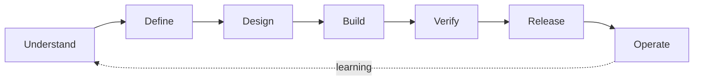
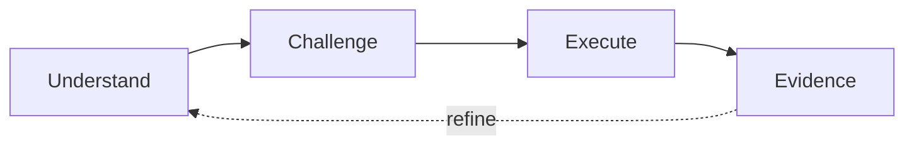

# AI-Native Software Engineering Framework

> Version: v1.5 Baseline  
> Status: Baseline  
> Audience: Engineer, Senior Engineer, Tech Lead, Architect, Engineering Manager, Department Head  
> Language: Traditional Chinese with English engineering terms  
> Governing documents: `00_Project_Charter.md`, `01_AI_Handoff.md`

---

## Executive Summary

AI coding 已經不是「要不要使用工具」的問題，而是軟體工程的工作方式正在改變。

本 Framework 的目的，是讓團隊在導入 AI 後，同時獲得三件事：

1. **更快理解複雜系統與問題。**
2. **更穩定地完成設計、實作、驗證與交付。**
3. **不犧牲 production safety、architecture integrity 與 human accountability。**

本 Framework 不把 AI 定義成自動寫 code 的助手，而是將它定位為參與整個 engineering lifecycle 的協作能力：從理解既有系統、挑戰需求與設計、產生與修改實作、建立驗證證據，到協助 release 與 operation。

框架採用三個相互獨立的控制維度：

- **Engineering Lifecycle**：`Understand → Define → Design → Build → Verify → Release → Operate`
- **AI Work Loop**：`Understand → Challenge → Execute → Evidence`
- **AI Execution Mode**：`Observe → Propose → Change → Act`

Engineering Lifecycle 回答「change 目前在哪個工程階段」；AI Work Loop 回答「每項工作如何與 AI 協作」；AI Execution Mode 回答「AI 在目前授權下可以做到哪裡」。

治理強度由三項因素形成 Control Profile：`System Criticality × Change Risk Tier × AI Execution Mode`。其中 L0–L3 是 work-item/change-level risk，不是對整個系統貼永久標籤。

框架的核心治理觀念是：

> **AI 可以擴大工程師的產能，但不能取代工程責任。**

AI output 不是完成條件；能被理解、驗證、追溯、部署與維運，才是工程交付。

---

## 1. Framework Purpose

### 1.1 要解決的問題

團隊開始使用 AI coding 後，常見問題不是工具不夠強，而是缺乏共同的工程方法：

- Engineer 直接讓 AI 改 code，沒有先建立 system understanding。
- Prompt 有答案，但需求、邊界與 acceptance criteria 不清楚。
- AI 一次產生大量變更，人無法有效 review。
- 測試數量增加，但沒有覆蓋真正的 business risk。
- 文件、code、test 與 deployment behavior 彼此不一致。
- 不同 Engineer 各自發明使用方式，成功經驗無法被團隊複製。
- Manager 只看使用率，沒有衡量 lead time、quality 與 operational outcome。
- 高風險 production system 與低風險 automation 使用同一套流程，造成過度治理或治理不足。

本 Framework 提供共同語言、最小必要控制與可重複使用的工作模式。

### 1.2 Framework 的定位

本 Framework 是：

- 部門級 AI engineering operating model。
- 從需求到維運的 end-to-end engineering framework。
- 能依風險調整治理強度的 capability model。
- 能被不同 AI coding tools 實作的 tool-agnostic framework。
- 對既有 SDLC、Architecture、DevOps、SRE 與 Security practice 的增強層。

本 Framework 不是：

- 單一 AI 工具的操作手冊。
- Prompt collection。
- 要求每個工作都產生完整文件的 waterfall process。
- 用 AI output 數量衡量成效的 productivity program。
- 取代既有 security policy、release policy 或 incident process 的新制度。
- 將工程責任轉移給 AI 的免責機制。

### 1.3 成功的定義

Framework 成功，不以 prompt 數、AI 產生 LOC 或工具登入率衡量，而以工程結果衡量：

- 新成員理解系統與完成第一個安全變更的時間縮短。
- Requirement ambiguity、design rework 與 review back-and-forth 降低。
- Change lead time 縮短，但 escaped defect 與 change failure rate 不上升。
- Test evidence、operational readiness 與 rollback readiness 更完整。
- Senior engineer 的 domain knowledge 能沉澱為 reusable context、rules、tests 與 patterns。
- 團隊能重複使用成功方法，而不是依賴少數 AI power users。

---

## 2. Design Principles

### P1. Engineering Outcome and Human Accountability

AI output 只是中間產物。每個交付都必須有 accountable human，能說明為什麼做、改了什麼、如何證明正確、失敗如何處理。完成條件是正確、可維護、可部署、可維運的 engineering outcome，不是 AI 產出量。

### P2. Context before Action

修改前先建立 system understanding 與 problem definition：boundary、runtime/data flow、dependencies、constraints、acceptance criteria、assumptions 與 unknowns。Framework 不綁工具，但 context、decision 與授權必須明確可見。

### P3. Controlled Change and Architecture Integrity

Change 應保持 small、reviewable、reversible，並遵守 system boundary、domain model、dependency direction、API contract、data ownership 與 operational model。若要改變這些規則，必須被明確視為 architecture decision。

### P4. Risk-based Evidence

AI 的語氣、解釋與自我評分不構成證據。控制強度與 evidence coverage 應依 system criticality、change risk 與 AI execution mode 決定。

### P5. Reusable Learning

有價值的 AI interaction 應沉澱成 tests、design rules、repository instructions、templates、runbooks、examples 或 decision records，而不是保存大量不可維護的 chat history。

---

## 3. AI-Native Operating Model

### 3.1 Engineering Lifecycle



| Stage | 核心問題 | 主要產出 |
|---|---|---|
| Understand | 系統現在如何運作？ | System model、code map、runtime/data flow、constraints |
| Define | 真正要解決什麼？ | Problem statement、scope、acceptance criteria、risk tier |
| Design | 應如何改變且不破壞系統？ | Design、contracts、trade-offs、failure handling、test strategy |
| Build | 如何用可 review 的方式實作？ | Code、config、migration、tests、documentation updates |
| Verify | 有什麼證據證明正確？ | Functional/non-functional evidence、review findings、risk closure |
| Release | 如何安全進入 production？ | Release plan、observability、rollback、approval evidence |
| Operate | 上線後是否健康並持續改善？ | Runtime evidence、incident learning、follow-up improvements |

Lifecycle 不是強制線性流程。小型 change 可以在短時間完成全部階段；複雜系統可能多次迭代。但任何 production change 都不能永久跳過 Define、Verify 與 Release responsibility。

### 3.2 AI Work Loop

每一個 lifecycle stage，都採用同一個四步閉環：



#### Understand

讓 AI 與人先對齊 context、goal、constraints、unknowns 與現況。輸出應是可檢查的 understanding，而不是立刻給 solution。

#### Challenge

主動尋找 ambiguity、missing case、wrong assumption、architecture conflict、operational risk 與 simpler alternative。

#### Execute

依已確認的 plan 進行分析、設計、實作或文件修改。變更保持 bounded、reviewable 與 reversible。

#### Evidence

產生或蒐集足夠證據，證明 output 符合 goal 與 constraints。若證據失敗，回到 Understand 或 Challenge，而不是用更多說明掩蓋問題。

### 3.3 AI Execution Mode

AI Execution Mode 定義 AI 在目前 task 與授權範圍內可以採取的最高行動。它不是能力成熟度，也不因工具「做得到」就自動升級。

| Mode | AI 可以做什麼 | Human control |
|---|---|---|
| **E0 — Observe** | Read、search、analyze、summarize；不修改 artifact 或 system | Owner 檢查理解與結論 |
| **E1 — Propose** | 產生 plan、design、draft、patch proposal；不套用 change | Human 選擇方向並核准執行範圍 |
| **E2 — Change** | 在授權 workspace/repository 修改、build、test、產生 evidence | Human review actual diff、tests 與 residual risk |
| **E3 — Act** | 影響 external system、shared environment、release 或 production state | Existing authorized owner 明確核准；需 observation 與 recovery control |

執行規則：

- Mode 依 action impact 判定，不依 prompt wording 判定。
- AI 可以在同一 task 中逐步升級 Mode，但每次升級都必須有相應授權與 verification。
- Production mutation、destructive action、irreversible migration 與 person-directed external action 一律屬於 E3。
- L0–L1 change 也可能包含 E3 action；L3 analysis 也可能停留在 E0。Execution Mode 與 Change Risk Tier 不互相取代。

### 3.4 核心工作契約

每個 AI-assisted task 至少應回答四個問題：

1. **Goal**：要達成什麼結果？
2. **Constraints**：不能破壞什麼？
3. **Change**：實際改了什麼？
4. **Evidence**：如何證明結果？

對 L0 工作，這四項可以只存在於 task description 與 final response；對 L2–L3 工作，應成為可追溯的 engineering artifacts。

### 3.5 Practical Capability Chain

為了讓 Engineer 直覺使用，Framework 的能力可展開為：

```text
Understand → Explore → Define → Design → Challenge → Plan → Implement → Verify → Release
```

Golden Playbook 將它收斂成五個日常入口：

| Golden Stage | Capability Chain |
|---|---|
| Research | Understand → Explore → Define |
| Design | Design → Challenge |
| Plan | Plan |
| Implement | Implement |
| Validate | Verify → Release handoff |

Explore 用於低承諾調查與 option shaping；Challenge 用於在投入 implementation 前主動找 ambiguity、contradiction 與 failure modes。兩者不能被「AI 已經產生答案」取代。

目前 Department Golden implementation 將 OpenSpec `/opsx:explore` 對應到 Explore capability：它是 E0、no-stakes、no-artifact/no-code 的 thinking action；若決定形成 change，必須交由 proposal/spec/design/tasks 等 durable artifacts 承接。Framework 保持 tool-agnostic，實際 command、Superpowers 與其他 skill mapping 由 `03_Golden_Engineering_Playbook.md` 管理。

Plan stage 有兩個不同深度，但不增加 lifecycle stage：先把 approved P1 Feature 切成 sprint-ready P0 vertical slices，再在單一 P0 即將執行時產生 implementation tasks。Department reference capability aliases 是 `to-tickets` 與 `writing-plans`；其 trigger、artifacts 與工具 mapping 由 `03_Golden_Engineering_Playbook.md` 管理。

---

## 4. Integration with Existing SDLC and Delivery Workflows

### 4.1 Integration Contract

> **AI-Native Engineering is an enhancement layer over the existing SDLC, not a parallel delivery process. It strengthens how teams understand, design, implement and verify change while retaining existing ownership, approval and production-control mechanisms.**

Framework 的 lifecycle、Golden Stages、AI Work Loop、artifacts 與 gates 必須嵌入 Team 已有的 backlog、design、development、PR、test、release、operation、incident 與 Change Management activities。它不建立另一套會議、文件鏈或 approval authority。

現有責任不因 AI 改變：

- Product/Engineering Owner 仍對 problem、scope 與 outcome accountable。
- Tech Lead／Architect 仍對 architecture、boundary 與 material design decision accountable。
- Reviewer 仍 review actual diff、tests 與 residual risk。
- Release／Service Owner、Change Management 與 authorized operator 仍擁有 production authority。
- AI 只能在明確 Execution Mode 與授權內協助理解、設計、執行與建立 evidence。

Golden Stage 與 Team workflow 的關係是：

> **Golden Stages are portable engineering decision states, not mandatory SDLC phases. A Team maps its existing delivery activities to one or more Golden Stages and carries the required information, decisions and evidence in its existing systems of record.**

因此 Golden Stage 不要求一對一對應 SDLC activity：一場 Backlog Refinement 可以同時包含 Research、Design 與 Plan；一個 PR 可以同時承載 Implement 與 Validate；Incident flow 即使不進 Sprint，仍可使用 Research、Implement、Validate。Golden Stage 可以跨 Sprint、跨活動、反覆迭代。

### 4.2 Golden Stage Integration Contract

下表是跨 Team 穩定的 integration contract；`Typical Existing Touchpoints` 只提供方向，不是 mandatory phase 或固定順序。

| Golden Stage | 核心工程問題 | Typical Existing Touchpoints | Minimum Information / Evidence |
|---|---|---|---|
| **Research** | 是否理解正確的 problem、current state 與 change boundary？ | Intake、Refinement、Analysis、Incident investigation | Problem/current behavior、evidence、scope、unknowns、initial risk signals |
| **Design** | 應改變什麼，為什麼選擇此方案？ | Refinement、RFC、Design/Architecture Review | Selected approach、trade-offs、contracts、failure/test direction |
| **Plan** | 如何形成可交付、可執行且可驗證的小步驟？ | Backlog refinement、Iteration planning、change planning | P0 slices、acceptance、dependencies/frontier、triggered JIT plan |
| **Implement** | 如何以 bounded、reviewable change 執行？ | Development、branch、configuration、migration preparation | Code/config/migration、tests、small reviewable changes、execution state |
| **Validate** | 有什麼 fresh evidence 支持完成、release 或持續運作？ | PR、pipeline、staging、release readiness、post-deploy observation | Acceptance/risk evidence、review closure、release/runtime evidence、residual risk |

Integration rules：

1. 一個 existing activity 可以承載多個 Golden Stages。
2. 一個 Golden Stage 可以跨多個 activities 或 Sprints。
3. Team 可以合併、改名、重排或省略不適用的 local activities，但不能省略對應 risk level 的 minimum information、decision responsibility 與 evidence。
4. 詳細 Intake／PR／Test／Release mapping 是 reference pattern，見 Appendix C；它不定義部門統一 SDLC。

### 4.3 Quality Gate Placement

Three Quality Gates 是 decision responsibility，不是三個新 meeting 或三份 mandatory form。

| Quality Gate | Typical Existing Touchpoints | Core Decision |
|---|---|---|
| **Understanding Gate** | Refinement、Research review、Design kickoff、incident handoff | 是否已正確理解問題、系統、scope、unknowns 與 change boundary？ |
| **Change Gate** | Design/Architecture Review、P0 slicing、implementation readiness | Design 與 plan 是否合理、安全、可實作、可驗證？ |
| **Evidence Gate** | PR review、test exit、release readiness、change approval | 是否有足夠 evidence 進入下一環境、release 或 production？ |

- L0／L1 change 可由同一位 Engineer 在 ticket、PR、pipeline 或 release record 中完成 gate evidence。
- L2／L3 才依既有治理觸發 formal review、additional approver、specialist evidence 或更完整 artifact。
- Gate pass 可以發生在既有活動中；沒有必要為 Framework 新增 ceremony。

### 4.4 Artifact Placement Model

> **Artifact requirement defines required engineering information and evidence, not a mandatory file format.**

Framework 所要求的資訊可以存在於 Azure DevOps／GitLab work item、OpenSpec Change、architecture document、ADR、Pull/Merge Request、test report、pipeline、release ticket、change request、dashboard、runbook 或 post-incident review，不一定是獨立 Markdown。

Placement rules：

1. **Reuse existing system of record first.**
2. **Avoid duplicated artifacts.** 同一 decision/evidence 不建立多份同步副本。
3. **Reference rather than copy.** SSOT 已存在時使用 link/reference，只記錄 bounded delta。
4. **Increase formality only when needed.** 只有 risk、scale、跨人 handoff 或 longevity 需要時才提高 artifact 形式與保存深度。

| Required Information / Evidence | Preferred Existing Placement |
|---|---|
| Problem、scope、acceptance、P0 type/risk | Epic／Feature／PBI／Issue |
| Research evidence、code map、system understanding | Work item attachment/link、repository guidance、architecture knowledge base、OpenSpec when durable |
| Architecture/design decision | Existing architecture document、ADR、RFC、OpenSpec `design.md` |
| P0 slices、`Blocked by`、execution frontier | Existing backlog/tracker |
| Per-P0 implementation steps | P0/Task、OpenSpec `tasks.md`、PR description or linked plan |
| Actual diff、review、tests | PR/MR、pipeline、test report |
| Release/E3 authorization and execution | Release ticket、change request、deployment record |
| Runtime/incident learning | Dashboard、monitoring evidence、runbook、post-incident review |

### 4.5 Agile, Backlog and Sprint Integration

Framework hierarchy 保留語意，但工具名稱只做 reference mapping：

```text
P3 Product / Program
→ P2 Epic
→ P1 Feature
→ P0 PBI / User Story
→ Execution Layer: Task / Plan Step / Commit
```

Team 可依 Azure DevOps、GitLab 或其他 tracker configuration 使用不同名稱，只要保留 outcome、decomposition 與 traceability semantics。

P0 進 Sprint／Iteration 前的 minimum Definition of Ready：

- Clear outcome and acceptance criteria。
- Known dependencies / `Blocked by`。
- Appropriate change boundary。
- Initial Change Risk Tier / Execution Mode。
- Enough understanding to begin safely；重大 unknown 可先以 Spike、Feature-level work 或明確 owner/decision path 處理。

P0 Definition of Done 不只代表 code complete：

- Acceptance criteria verified；required tests passed。
- Material review findings resolved。
- Documentation／contract／runbook updated when applicable。
- Release and operational evidence appropriate to risk。
- Residual risk and next owner visible。

Sprint boundary 不等於 Golden Stage boundary。Research、Design 與 Validate 可以是同一 Sprint activity、前置 Spike、Feature-level work 或 cross-Sprint activity；Framework 不強制所有 Team 使用相同 time-box 或 phase 切割。

### 4.6 Release, Change Management and E3 Integration

E3 — Act 不建立新的 authorization model，AI 也不能成為 production approver。所有 shared、external 或 production action 必須承接既有 Release、Change Management、service ownership 與 production-control mechanism。

AI 可以協助準備 deployment plan、validation steps、rollback/recovery procedure、change summary 與 observation evidence；只有在 authorized owner 明確授權、action scope bounded、結果可觀測且 recovery 可執行時，AI 才能執行 E3 action。

Production mutation、irreversible migration、destructive operation 或 blast-radius-expanding action 必須有 explicit authorization：

```text
Verified Change
→ Release Readiness
→ Existing Change Approval
→ Explicit E3 Authorization
→ Execute
→ Observe
→ Validate
→ Recover / Rollback if required
```

### 4.7 Team-owned Integration and Template Governance

Department 一致性來自 contract 與 quality bar，不是所有 Team 使用同一模板或 SDLC 名稱。

| Department Framework owns | Each Team owns |
|---|---|
| Golden Stages、minimum required information、artifact contract、quality criteria | Local activity → Golden Stage mapping、local Gate placement |
| Risk-triggered additions、required traceability | Team templates、tracker fields、repository instructions |
| Examples、reference patterns、shared terminology | Technology-specific validation checklist、product-specific DoD |
| Department-level governance and evidence bar | Domain constraints、local examples、reusable prompts/skills |

Governance chain：

```text
Department Framework
→ defines minimum contract and quality bar

Team Operating Model / Playbook / Template
→ adapts the contract to local product, SDLC and workflow

Work Item / Design / PR / Change Record
→ carries actual execution decisions and evidence
```

Team template 可以不同，但不得省略 Framework 在對應 risk level 下要求的 minimum information、decision owner、traceability 與 evidence。

### 4.8 Existing Pilot Evidence Model

Department 已有至少十個由 Department Head 主導的實際 pilot cases。這些 cases 是既有 evidence base；Framework 不再建立「先執行新的 pilots 才能成立」的門檻。

下一步是 case consolidation：

1. 盤點既有十個以上 cases。
2. 每個 case mapping 到 Work Level、Archetype、Golden/Lifecycle stage、AI Work Loop、Risk Tier、Execution Mode、artifacts/evidence、outcome 與 lessons learned。
3. 選出 3–5 個 canonical cases 納入 Framework／Training。
4. 其餘 cases 進入持續演進的 Case Library，支援 Team adoption 與 governance review。

Case record 必須同時保留 success 與 failure learning：AI 曾在哪裡誤解、哪些 design 被 challenge 後修改、哪些 verification 發現問題、哪些 decision 仍由 human judgment 主導，以及哪些 tests/rules/runbooks/assets 被沉澱重用。

---

## 5. Change Risk Tier and Control Profile

### 5.1 Change Risk Tier 的目的

Change Risk Tier 用來決定一個 work item/change 需要多少 design、review、test、release 與 documentation rigor。它不是系統的重要性排名，也不是對 repository 的永久標籤。

Tier 應在 Define stage 初步判定；若 scope、blast radius、irreversibility 或 uncertainty 擴大，必須重新評估。Tier 不能因趕時程而降低，但可以在 evidence 證明風險較低後由 accountable owner 調整。

### 5.2 分級定義

| Tier | 典型情境 | 影響與特徵 | 治理方式 |
|---|---|---|---|
| **L0 — Local / Assistive** | 文件整理、探索分析、local prototype、無 shared/production impact | 容易重做，沒有 durable system behavior change | Owner self-check；輕量 evidence |
| **L1 — Standard Change** | 單一 component 的一般 feature、bug fix、test improvement、低風險 config | Boundary 清楚、已有 pattern、可回復、blast radius 有限 | Standard review、risk-relevant tests、basic release evidence |
| **L2 — Significant Change** | 跨 component/contract、data migration、shared platform change、重大效能調整 | 多方依賴、failure modes 較多、回復成本高或 architecture impact 明顯 | Written design、independent review、risk-specific evidence、controlled rollout when applicable |
| **L3 — Critical Change** | 改變 critical control path、hold/safety decision、security control、核心共用 runtime、不可逆 data state 或大規模 rollout | 失敗可能影響生產、資料正確性、安全或重大營運 | Accountable owner/architecture approval、完整 risk coverage、operational readiness、verified recovery where feasible |

### 5.3 System Criticality 與 Change Risk

System Criticality 是系統既有屬性；Change Risk Tier 是本次 change 的屬性。兩者必須分開判斷。

- Inline-critical system 不代表每個 change 都是 L3。
- 若 change 觸及 critical runtime path、control decision、shared dependency、production data state 或 recovery mechanism，System Criticality 會提高最低 Tier。
- 文件、test-only change、isolated tooling 或不影響 runtime behavior 的 refactor，仍依實際 blast radius 與 reversibility 判定。

Change Risk 以最高 material risk 維度決定，而不是取平均：

| 維度 | 判斷問題 |
|---|---|
| Production Impact | 失敗是否會中斷 production、造成錯誤 decision 或影響大量使用者？ |
| Blast Radius | 影響單一使用者、單一 component、跨系統或多 site？ |
| Reversibility | 是否能快速 rollback？是否涉及不可逆 data change？ |
| Architecture Impact | 是否改變 boundary、contract、data ownership 或共用平台？ |
| Data / Security | 是否接觸高敏感資料、權限模型、audit 或 regulated control？ |
| Operational Complexity | 是否新增 distributed failure mode、state、concurrency 或 recovery path？ |
| Uncertainty | Domain、legacy behavior、dependency 或 root cause 是否仍有重大未知？ |

### 5.4 Control Profile

```text
Control Profile = System Criticality × Change Risk Tier × AI Execution Mode
```

- Change Risk Tier 決定 engineering rigor。
- System Criticality 決定不能忽略的 domain/operational consequences。
- AI Execution Mode 決定 human authorization 與 action control。

以下為 default expectations；`Risk-based` 或 `When affected` 不是 optional，而是由實際風險觸發：

| Control | L0 | L1 | L2 | L3 |
|---|---:|---:|---:|---:|
| Clear goal and constraints | Required | Required | Required | Required |
| Acceptance criteria | Lightweight | Required | Required | Required |
| Written design | Optional | Change note | Required | Required + approval |
| Independent human review | Optional | Required | Required | Required + domain/architecture owner |
| Automated functional test | As applicable | Risk-based | Required for behavior change | Required for behavior change |
| Non-functional verification | Optional | When affected | When affected | Required for affected critical qualities |
| Rollback / recovery plan | Optional | When deployed | Required when state/runtime affected | Required + verified where feasible |
| Staged rollout | Optional | When runtime risk exists | When runtime risk exists | Required for deployable runtime change |
| Post-release observation | Owner check | Required | Required | Required + defined observation window |

### 5.5 Universal Controls

所有 AI-assisted engineering work 只有三項 universal controls：

1. **Clear Intent**：Goal、scope、constraints 與 expected outcome 清楚。
2. **Human Accountability**：Owner、decision rights 與 AI Execution Mode 清楚。
3. **Risk-based Evidence**：Evidence coverage 與 change risk 相稱。

各 stage 的 Core Questions 用來落實這三項 controls，不代表額外建立 21 項 mandatory checklist。其他要求由 Tier、affected quality 與 execution mode 觸發。

執行上遵守：

- 同一份 evidence 可同時滿足多個 control，不重複造文件。
- Existing PR、test report、dashboard、ADR、ticket 或 runbook 可直接作為 evidence。

### 5.6 Delivery Level and Work Archetype

Change Risk Tier 決定控制強度；Delivery Level 決定工作如何拆解與需要哪些 lifecycle artifacts。兩者不得混用。

| Delivery Level | 定義 | Decomposition Rule |
|---|---|---|
| **P3 — Product / Program** | Greenfield product、legacy modernization/migration、長期 platform initiative | 先建立 product/program direction，再拆成 P2 Epics |
| **P2 — Epic** | 跨 feature/component 的完整 business or technical capability | 建立 architecture delta 與 feature map，再拆成 P1 Features |
| **P1 — Feature** | 可獨立驗收、部署或以 feature flag 控制的 bounded outcome | 完成 approved design，再拆成 P0 PBI/User Story vertical slices |
| **P0 — PBI / User Story** | Sprint-ready、narrow but complete、demoable 且可獨立驗證的 vertical slice | 標示 dependency；即將執行時再拆成 Execution Layer tasks/steps/commits |

P0 可為 **User Story、Engineering Story / Enabler、Bug、Spike**。一般 P0 應可 demo 並以 acceptance evidence 獨立驗證；Spike 必須 time-boxed，並以可驗證的 research evidence、decision 或風險消除結果完成，不以 production behavior 為必要條件。

`Task / Plan Step / Commit` 是 P0 下方的 **Execution Layer**，不是正式 Delivery Level。Task 只描述如何實作一張 P0，不取代 P0 的 outcome 與 acceptance criteria。

`Change` 不是固定 hierarchy level。OpenSpec Change 是 durable engineering artifact container，必須宣告承載 scope；它可以承載 coherent P1 Feature，也可以承載需要 durable agreement 的 P0 PBI，但不等同於 P0。

Work Archetype 決定 Research 與 Design 的重點：

- **Greenfield Product**：problem/domain discovery、product boundaries、architecture runway、MVP learning。
- **Legacy Modernization / Migration**：as-is behavior、dependency/data discovery、characterization、compatibility、migration/cutover/recovery。
- **Standard Delivery**：existing product boundary 內的 epic、feature、bug、refactor 或 operation automation。

Delivery Level 與 Work Archetype 的具體流程、skill mapping、inputs、outputs 與 gates，由 `03_Golden_Engineering_Playbook.md` 定義。

### 5.7 Tracker Reference Mapping

Framework 保持 tool-agnostic；以下只提供 reference mapping，不改變 capability model。

| Framework | Azure DevOps reference | GitLab reference |
|---|---|---|
| P3 Product / Program | Portfolio / Roadmap context | Top-level Epic / Group Roadmap |
| P2 Epic | Epic | Epic |
| P1 Feature | Feature | Child Epic，或 team convention `type::feature` |
| P0 PBI / Story | PBI / User Story / Bug | Issue；以 story / enabler / bug / spike work-item type 或 label 區分 |
| Execution Layer | Task | Task child item 或 checklist |
| Implementation | Branch / PR / Commit | Merge Request，連回 P0 Issue |
| Release / Sprint | Existing release/sprint construct | Milestone / Iteration |

GitLab Milestone／Iteration 是 time-box、release 或 planning dimension，不是 hierarchy level。Azure DevOps Bug 的 backlog/task placement 可依 process configuration 調整；本表以 P0 backlog item 為 department reference default。GitLab `type::feature` 與 story/enabler/bug/spike 命名是可替換的 team convention，不是 Framework dependency。

Reference：Azure DevOps [Define features and epics](https://learn.microsoft.com/en-us/azure/devops/boards/backlogs/define-features-epics?view=azure-devops) / [About work items](https://learn.microsoft.com/en-us/azure/devops/boards/work-items/about-work-items?view=azure-devops)；GitLab [Child items](https://docs.gitlab.com/user/work_items/child_items/) / [Milestones](https://docs.gitlab.com/user/project/milestones/)。

---

## 6. Stage 1 — Understand

### 6.1 Objective

在提出 change 前，建立足夠準確的 system understanding，避免 AI 根據檔名、局部 code 或一般經驗猜測系統行為。

### 6.2 Core Questions

1. **System map 是否足以支持本次 change？** 至少識別 entry point、主要 flow、dependencies 與 change boundary。
2. **Facts、assumptions 與 unknowns 是否已分開？** 不把推測寫成現況。
3. **Current behavior 有什麼 evidence？** 可使用 tests、runtime logs、metrics、documents、config、schema、history 或 incident record。

### 6.3 Recommended Practices

- 先要求 AI 輸出 understanding summary，再允許修改。
- 使用 repository search 與 call-chain tracing，而不是只讀單一檔案。
- 對 legacy system 建立 glossary、component map 與 data flow。
- 以 representative examples 驗證 AI 對 domain rule 的理解。
- 對 incident 先建立 timeline，再進行 root-cause hypothesis。
- 對 unfamiliar repository，識別 build、test、deploy、ownership 與 coding conventions。

### 6.4 Minimum Deliverable

依工作規模，可使用以下任一形式：

- PR/task 中的 Understanding Summary。
- Markdown system map。
- Component/runtime/data-flow diagram。
- Incident timeline 與 hypothesis table。
- Repository onboarding note。

### 6.5 Exit Criteria

進入 Define 前，Owner 至少能回答：

- 哪些 component 與 contract 會被影響？
- Current behavior 的 evidence 是什麼？
- 哪些資訊仍未知？未知是否會改變 solution？
- 誰擁有相關 domain、system 與 production responsibility？

### 6.6 Failure Patterns

- 只根據 README 就宣稱理解整個系統。
- AI 未讀 code 就產生 architecture redesign。
- 將 naming similarity 當成 runtime dependency。
- 只看 happy path，忽略 retry、timeout、partial failure 與 recovery。
- 為了快速開始而隱藏 unknowns。

---

## 7. Stage 2 — Define

### 7.1 Objective

把模糊需求轉換為可驗證的 engineering problem，避免團隊高效率地解錯問題。

### 7.2 Core Questions

1. **Problem Statement 是否清楚？** 描述 current condition、desired outcome 與 business/engineering impact。
2. **Scope 與 Non-goals 是否清楚？** 說明本次處理與不處理的範圍。
3. **Acceptance Criteria 是否可驗證？** 必須能被 test、observation 或 review 證明。

### 7.3 Problem Definition Template

```text
Problem:
Current behavior:
Expected outcome:
Why it matters:
In scope:
Out of scope:
Constraints:
Acceptance criteria:
Project tier:
Open questions:
```

### 7.4 AI 的角色

AI 在 Define stage 最有價值的工作不是重寫需求，而是：

- 找出 ambiguous terms。
- 將 solution statement 還原成 problem statement。
- 產生 edge cases 與 counterexamples。
- 檢查 acceptance criteria 是否可測試。
- 比較 stakeholder expectations 是否衝突。
- 辨識 hidden non-functional requirements。

### 7.5 Exit Criteria

- Problem 與 expected outcome 已被 Owner 確認。
- Scope、non-goals 與 constraints 清楚。
- Acceptance criteria 能對應 evidence。
- Change Risk Tier 與 AI Execution Mode 已初步判定。
- Blocking unknowns 已解決或有明確處理策略。

### 7.6 Failure Patterns

- Ticket 只有 solution，沒有 problem。
- Acceptance criterion 是「完成開發」或「測試正常」。
- 把 AI 產生的長篇 PRD 當作需求已經清楚。
- 為了避免 stakeholder discussion，用 AI 填補 business decision。
- Scope 持續成長但 Tier 與 plan 不變。

---

## 8. Stage 3 — Design

### 8.1 Objective

選擇符合需求、architecture boundary 與 operational reality 的 change design，並在實作前暴露主要 trade-off 與 failure mode。

### 8.2 Core Questions

1. **Change boundary 與 contracts 是否清楚？** 包含 interface、data、state 與 dependency impact。
2. **Failure behavior 是否完整？** 處理 timeout、retry、partial failure、degradation、recovery 與 observability。
3. **Verification strategy 是否覆蓋 material risks？** 每個主要風險至少有對應 evidence 方法。

### 8.3 System Design Scope and Trigger

System Design 是 Design stage 內的明確 capability，用來決定 system boundary、component responsibilities、contracts、runtime/data flow、NFR、failure/recovery 與 operational model。它不是新的 lifecycle stage，也不等同於 implementation-level Feature Design。

| Delivery Level | System Design Requirement |
|---|---|
| **P3 Product / Program** | Required：定義 product/target architecture、ownership boundary、operating model 與 Epic/Wave decomposition |
| **P2 Epic** | Required：定義 architecture delta、cross-feature contracts、data/runtime flow 與 Feature Map |
| **P1 Feature** | Risk-based：跨 boundary/contract/data、重大 NFR、novel architecture 或 L2–L3 時 required；其他情況使用 Feature/Detailed Design |
| **P0 PBI / Story** | Normally not required；若需要改變 architecture boundary，升級為 P1/P2 處理 |

System Design 的工作契約：

```text
Research Evidence
→ Architecture Options
→ Selected System Design
→ Challenge / Review
→ ADRs + Decomposition
→ P1/P0 Delivery Planning
```

Minimum System Design Pack 依 scope/risk 裁剪，包含：System Context、ownership/component boundaries、key runtime/data flows、contracts、NFR、failure/recovery/observability、deployment/operation considerations、ADRs 與 decomposition。

System Design Review 是 **Change Gate 在 P3、P2 與 triggered P1 的 implementation**，不是第四個 Universal Quality Gate。既有 architecture/design artifact 可直接承載，不要求建立重複文件。

### 8.4 Design Depth by Tier

| Tier | 建議設計產物 |
|---|---|
| L0 | PBI/ticket note 或 implementation outline |
| L1 | PR design note：approach、impact、test plan |
| L2 | Design document：context、options、contracts、runtime/data flow、failure handling、rollout |
| L3 | L2 內容加上 architecture review、capacity/HA/security/operation evidence 與 decision record |

### 8.5 Design Review Questions

#### Boundary

- 這項能力應由哪個 component 擁有？
- 是否破壞 dependency direction 或 data ownership？
- 是否把 domain logic 放進 gateway、script 或 shared library 等錯誤位置？

#### Contract

- API、event、schema、file format 與 configuration 是否 backward compatible？
- Versioning、validation 與 migration policy 是什麼？
- Producer 與 consumer 對 error semantics 的理解是否一致？

#### Runtime

- 正常 flow 與 failure flow 是什麼？
- Timeout、retry、idempotency、ordering、concurrency 與 backpressure 如何處理？
- Dependency unavailable 時，系統 fail-open、fail-closed 或 degrade？

#### Data

- Source of truth 是什麼？
- State transition、transaction boundary 與 reconciliation 如何處理？
- Schema change 是否可向前／向後相容？

#### Operation

- 如何知道系統正常？
- 如何定位 failure？
- 如何 rollback、recover 或 replay？

### 8.6 AI-assisted Design Workflow

1. Engineer 提供 problem、system context、constraints 與 current architecture。
2. AI 先列出 assumptions、unknowns 與 affected boundaries。
3. AI 產生不超過三個 viable options，包含 trade-offs。
4. Engineer 選擇方向並補上 domain/operational judgment。
5. AI 以 adversarial review 挑戰 design。
6. Engineer 關閉 material risks，形成 design decision。

### 8.7 Exit Criteria

- Selected design 與選擇理由清楚。
- Major alternatives 與 trade-offs 已處理。
- Contracts、data/state impact 與 failure behavior 已定義。
- Verification、rollout、rollback direction 可行。
- P3、P2 與 triggered P1 的 System Design Pack、ADRs、decomposition 與 review 已完成。
- L2–L3 已完成所需 review。

---

## 9. Stage 4 — Build

### 9.1 Objective

將 design 轉換為小而可驗證的 engineering changes，維持 repository conventions、architecture integrity 與可 review 性。

### 9.2 Core Questions

1. **Implementation plan 是否 bounded？** 明確列出預計修改區域、順序與驗證方式。
2. **Change 是否 reviewable？** 避免 unrelated refactor、formatting 與 behavior change 混在一起。
3. **Tests 與 affected documents 是否同步？** 不把驗證延後成另一個不確定工作。

### 9.3 Implementation Unit

Build stage 執行的是 P0 下方的 **Execution Layer**：Task、Plan Step 與 Commit。這些單位是 implementation decomposition，不是 P0 Work Level。完整 P0 必須保留 outcome、acceptance criteria 與獨立 verification；Execution Layer 則把它轉成可安全 review 的實作步驟。

好的 AI implementation unit 應具備：

- 單一清楚目的。
- 可在有限時間內由人理解。
- 具有明確 input/output 或 behavior contract。
- 有對應 test 或 verification method。
- 失敗時容易回復或調整。

### 9.4 Repository Context

成熟 repository 應提供 AI 可讀的 engineering context，但內容要短、穩定、可維護：

- System purpose and boundaries。
- Build/test/run commands。
- Architecture rules and dependency direction。
- Coding and testing conventions。
- Security/data handling references。
- Definition of Done。
- Known dangerous areas and generated code rules。

不要把大量歷史背景全部塞進單一 instruction file。易變內容應留在 design、ticket 或 versioned document。

### 9.5 AI Change Protocol

AI 執行 code change 時，應遵守：

1. 先列出預計修改的 files/components。
2. 先找 existing pattern，再建立新 abstraction。
3. 不修改 task scope 外的 user changes。
4. 不在沒有 approval 的情況下執行 destructive operation。
5. 每個重要 assumption 都應可見。
6. 修改後執行與風險相稱的 tests/checks。
7. 最後摘要實際 change、evidence 與 remaining risk。

### 9.6 Refactoring with AI

AI 很適合進行 mechanical transformation，但 refactor 仍須區分：

- **Behavior-preserving refactor**：以 existing tests、characterization tests 與 diff control 證明行為不變。
- **Behavior-changing redesign**：必須回到 Define/Design，不得以 refactor 名義隱藏功能變更。

對 legacy code，先補 characterization tests，再做結構調整。若沒有足夠 testability，先縮小改動範圍。

### 9.7 Generated Code Policy

AI-generated code 與 human-written code 使用相同品質標準：

- Owner 能說明設計與關鍵邏輯。
- Code 符合 repository conventions。
- Dependencies 有必要性且版本清楚。
- Error handling、logging、resource lifecycle 與 concurrency 被正確處理。
- Tests 驗證 behavior，不只是覆蓋 lines。
- 沒有殘留 placeholder、fake success path 或未揭露的 assumption。

### 9.8 Exit Criteria

- Implementation 符合 approved scope/design。
- Diff bounded 且可 review。
- Required tests、documentation、config/schema/migration 同步完成。
- 沒有未處理的 critical finding。
- 可進入獨立 Verify，而不是只依賴作者自我確認。

---

## 10. Stage 5 — Verify

### 10.1 Objective

建立可信 evidence，證明 change 在功能、整合、效能、可靠性、安全性與操作面符合要求。

### 10.2 Core Questions

1. **Acceptance criteria 是否都有 evidence？** 每個重要結果都能指出驗證方式與結果。
2. **Evidence 是否驗證 risk，而非只驗證 implementation？** 涵蓋 affected failure path、boundary 與 operational behavior。
3. **Accountable human 是否 review evidence？** AI 可以產生與分析測試，但不能自行宣布 production readiness。

### 10.3 Evidence Portfolio

Evidence 不是單一由弱到強的階梯。Production observation 不能取代 unit、contract、security 或 recovery test；不同 evidence 回答不同風險。

| Coverage | 回答的問題 | 典型 evidence |
|---|---|---|
| Understanding | Current behavior 與 root cause 是否正確？ | Code/runtime trace、representative examples、reproduction |
| Functional correctness | Business behavior 是否符合 acceptance criteria？ | Unit、component、scenario、invariant tests |
| Contract compatibility | Producer/consumer、schema、version 是否相容？ | Contract tests、schema checks、compatibility matrix |
| Data integrity | Migration、state transition、reconciliation 是否正確？ | Rehearsal、checksum、reconciliation、backup/restore |
| Non-functional qualities | Performance、capacity、security、reliability 是否受影響？ | Benchmark、load/soak、security checks、resource profile |
| Failure and recovery | Dependency failure、timeout、retry、failover 是否可控？ | Failure injection、recovery test、HA drill |
| Operational readiness | 是否能觀察、定位、rollback/recover？ | Metrics/logs/traces、alert、dashboard、runbook verification |
| Release outcome | 真實 workload 下是否符合預期？ | Controlled rollout、observation window、business indicators |

每項 change 先識別 material risks，再選擇必要 coverage。高 Tier 代表 coverage 更廣與 evidence 更強，不代表所有 change 執行同一套 test suite。

### 10.4 Test Strategy by Risk

| 風險 | 主要 evidence |
|---|---|
| Business rule error | Example-based + boundary + property/invariant tests |
| Contract incompatibility | Consumer/producer contract tests、schema compatibility |
| Data corruption | Migration rehearsal、checksums、reconciliation、backup/restore |
| Concurrency/state error | Race/ordering/idempotency tests、state transition tests |
| Dependency failure | Timeout/retry/degradation/fallback tests |
| Performance regression | Baseline comparison、load/soak test、resource profile |
| Availability risk | Failover/recovery drill、multi-zone behavior、dependency outage test |
| Operational blindness | Metrics/logs/traces/dashboard/alert verification |

### 10.5 AI-assisted Review Modes

AI review 應明確指定 review mode，避免只得到泛化建議：

- Correctness review。
- Architecture boundary review。
- Failure-mode review。
- Security/data exposure review。
- Concurrency/state review。
- Performance/resource review。
- Test quality review。
- Operability review。
- Minimality/simplification review。

每次 review 最多聚焦一到三個 mode。高風險 change 可分輪進行，不要一次要求「全面 review」後接受表面答案。

### 10.6 Finding Severity

| Severity | 定義 | 處置 |
|---|---|---|
| Blocker | 可能造成重大錯誤、production impact、data/security issue | Release 前必須修正或由 accountable owner 正式接受 |
| Major | 明顯 correctness、reliability、maintainability 或 operability risk | 原則上 release 前修正 |
| Minor | 局部品質問題，不影響主要行為 | 修正或建立 follow-up |
| Suggestion | 可讀性、簡化或未來改善 | Owner 判斷 |

AI 提出的 finding 必須經 evidence 驗證。不存在的問題、無法重現的推論或與 scope 無關的建議，不應轉成工作量。

### 10.7 Exit Criteria

- Acceptance criteria 全部有 evidence。
- Required test suites 通過。
- Material risks 已關閉或被明確接受。
- Review findings 已處理。
- Release、rollback 與 observation 所需資訊完整。

---

## 11. Stage 6 — Release

### 11.1 Objective

以可觀察、可控制、可回復的方式將 change 導入 production。

### 11.2 Core Questions

1. **Release success/failure signals 是否已定義？** 上線前就知道看哪些 metrics、logs、business indicators。
2. **Rollback 或 recovery action 是否可執行？** 包含觸發條件、owner 與限制。
3. **Operational ownership 是否清楚？** 誰 release、誰觀察、誰在異常時做 decision 必須明確。

### 11.3 Release Strategy by Tier

| Tier | 典型策略 |
|---|---|
| L0 | Local delivery 或 controlled internal use |
| L1 | Standard deployment + smoke test + owner observation |
| L2 | Staged rollout / canary / blue-green + defined observation window |
| L3 | Controlled progressive rollout + readiness review + rollback/recovery verification + command ownership |

### 11.4 Release Readiness

Release 前應依風險確認：

- Artifact/version/config/schema 已鎖定。
- Dependency 與 compatibility 條件滿足。
- Monitoring、dashboard、alert 與 log query 可用。
- Capacity 與 resource limit 合理。
- Migration、backfill、reconciliation 已排程。
- Rollback 是否真的可行；若不可逆，recovery strategy 是什麼。
- On-call/operation team 已取得必要資訊。

### 11.5 AI 的角色

AI 可協助：

- 產生 release checklist 初稿。
- 比對 config 與 manifest drift。
- 整理 change summary、risk 與 rollback steps。
- 分析 rollout metrics、logs 與 abnormal signals。
- 對照 expected vs observed behavior。

AI 不應自行執行未授權的 production mutation，也不應取代 accountable owner 的 go/no-go decision。

Release 必須使用既有 organizational control path。對 E3 action，實際順序是：verified change 先完成既有 release readiness 與 change approval，再由 authorized owner 明確授權執行；執行後立即 observe、validate，必要時 recover／rollback。Framework 不新增 approver、CAB 或 production role，詳見 4.6。

### 11.6 Exit Criteria

- Deployment 完成且版本可追溯。
- Success signals 在 observation window 內正常。
- 無 unresolved release blocker。
- 若發生異常，已完成 rollback/recovery 或進入 incident process。
- Release evidence 已回寫到 ticket/PR/release record。

---

## 12. Stage 7 — Operate and Learn

### 12.1 Objective

確認 change 在真實 production workload 下持續健康，並把 operational learning 回饋為可重用 engineering assets。

### 12.2 Core Questions

1. **真實 outcome 是否符合預期？** 不只看 deployment success，也看 business behavior、latency、error、resource 與 dependency health。
2. **異常是否轉成可追蹤 learning？** Incident、near miss、manual workaround 與 recurring alert 應回饋到 backlog 或 control。
3. **System knowledge 是否已更新？** Architecture、runbook、test、rule 或 repository context 必須與現況一致。

### 12.3 Operational Evidence

依系統性質選擇：

- Throughput、error rate、latency、saturation。
- Business/domain correctness indicators。
- Queue lag、retry、timeout、dead letter、reconciliation gap。
- Availability、failover time、recovery time。
- Cost/resource utilization。
- Change failure、incident、alert noise 與 manual operation。

### 12.4 Incident Use Case

AI 可協助 incident response，但必須以 operational command structure 為主：

1. 收集 timeline 與 evidence。
2. 區分 observed facts、hypotheses 與 actions。
3. 產生 candidate root causes 與 falsification checks。
4. 協助 log/query/code correlation。
5. 整理 mitigation、recovery 與 follow-up。

在 production incident 中，AI 建議不能直接等同操作命令。所有 destructive、irreversible 或 blast-radius-expanding actions 仍需人員授權。

### 12.5 Learning Assets

值得保留的不是完整 chat history，而是：

- 新增或改善的 automated tests。
- Architecture rule / ADR。
- Incident detection rule。
- Runbook / recovery procedure。
- Reusable prompt pattern。
- Repository instruction。
- Domain examples / glossary。
- Code generator、validator 或 automation。

---

## 13. Role Expectations

### 13.1 Engineer

Engineer 是 AI-assisted work 的直接 Owner。

應具備：

- 能提供清楚 goal、constraints 與 context。
- 能讀懂並解釋 AI 產生的 change。
- 能建立與執行 verification。
- 能辨識 AI hallucination、overengineering 與 unsafe assumption。
- 能將工作切成 bounded changes。

Engineer 不得以「AI 產生」作為無法解釋 code 或缺乏 tests 的理由。

### 13.2 Senior Engineer / Tech Lead

Senior 的價值從「比別人寫更多 code」提升為：

- 定義正確 problem 與 engineering method。
- 提供 domain judgment 與 architecture constraints。
- 設計可重用 patterns、tests 與 guardrails。
- Review high-risk assumptions 與 failure modes。
- 教導團隊如何使用 AI，而不是代替團隊使用 AI。

### 13.3 Architect

Architect 負責：

- 維護 system boundary、domain model 與 architecture principles。
- 對 L2–L3 change 提供必要 review。
- 將 recurring decision 轉換成 reusable guidance。
- 避免 AI 造成 local optimization、architecture drift 與 accidental coupling。
- 確認 critical design 同時涵蓋 runtime、data、HA、security、observability 與 operation。

### 13.4 Engineering Manager

Manager 不只推動工具採用，而是建立 team capability：

- 將既有 pilot learning 整理成可重用 Team practice，並選擇後續高價值 use cases。
- 確保 team 有時間學習、review 與沉澱方法。
- 以 engineering outcome 評估 adoption。
- 管理 workload，避免 AI 加速產生更多未完成工作。
- 對 L2–L3 的 ownership、reviewer 與 release command 做清楚安排。
- 親自使用 AI 維持對能力、限制與風險的判斷力。
- 維護 Team 的 local workflow mapping、templates、tracker fields 與 Definition of Done。

### 13.5 Department Head

Department Head 負責 operating model 與 adoption portfolio：

- 定義共同 framework 與最低標準。
- 建立跨 team learning mechanism。
- 將既有十個以上 pilot cases consolidation 成 evidence base、canonical cases 與 Case Library。
- 選擇 strategic use cases，平衡 productivity、quality 與 risk；不以重新執行 pilot 作為 Framework 成立門檻。
- 移除工具、環境、資料與治理障礙。
- 對 CIO／Division Head 以 business and engineering outcomes 報告。

### 13.6 Human Accountability Matrix

| Decision | Accountable Human |
|---|---|
| Problem 與 scope 是否正確 | Product/Engineering Owner |
| Design 是否符合 architecture | Tech Lead / Architect，依 Tier |
| Code 是否可接受 | Change Owner + Reviewer |
| Evidence 是否足夠 | Change Owner；L2–L3 由 reviewer/chair 確認 |
| Production go/no-go | Release/Service Owner |
| Incident action | Incident Commander / authorized operator |

---

## 14. Core AI Engineering Use Cases

Use case 不建立獨立流程；全部使用相同 Lifecycle、Work Loop、Change Risk Tier 與 Execution Mode。

| Use Case | AI 的主要價值 | Minimum Evidence / Guardrail |
|---|---|---|
| System Understanding | 建立 component/runtime/data model、glossary、unknowns | 以 code、runtime evidence 與 representative examples 驗證，不只讀 README |
| Requirement / Design Challenge | 找 ambiguity、missing case、trade-off、failure mode | Finding 必須指向具體 claim、impact 或 decision |
| Feature / Change Implementation | 產生 bounded plan、reviewable change、tests | Actual diff、acceptance evidence、residual risk |
| Legacy Modernization | Reverse-engineer behavior、找 seams、逐步替換 | Characterization tests；已知 bug 明確 preserve 或 correct |
| Incident / Bug Fix | Timeline、hypothesis、falsification、root cause | Reproduction、minimal fix、regression test、detection improvement |
| Test / Quality Review | 擴展 case space、找 boundary 與 invariant | Human 定義 risk model、oracle；不以 test count 代替 quality |
| Operation Automation | 自動化 diagnosis、validation、release/runbook steps | 高風險 action 需 dry-run、authorization、audit、idempotency、recovery |
| Generator / Knowledge-to-Code | 將 domain knowledge 轉成 schema、rules、validators、tests | Source 可追溯、output 可驗證、rule/version 可管理、generator/runtime 分離 |

### 14.1 Worked Example — L1 Standard Bug Fix

情境：單一 service 在特定 optional field 為空時回傳錯誤；已有清楚 API contract、unit test framework 與標準 deployment path。

| Dimension | Decision |
|---|---|
| System Criticality | Service 屬 production system，但本次不改 critical control path |
| Change Risk Tier | L1；單一 component、root cause 可重現、change 可回復 |
| AI Execution Mode | E2 Change；可修改 repository 並執行 tests，不能自行 deploy |
| Core Evidence | Reproduction、boundary/regression tests、reviewable diff、smoke test |
| Not Required | 新 architecture document、HA drill、全面 load test |

工作閉環：AI 先重現並解釋 root cause，挑戰 null/empty/boundary cases，提出 minimal patch，執行 regression tests；Human owner review diff 與 evidence 後使用既有 release process。

### 14.2 Worked Example — L3 Critical Runtime Change

情境：修改 inline system 的 hold decision path，且該邏輯由多個 production services 共用。

| Dimension | Decision |
|---|---|
| System Criticality | Critical；錯誤 decision 可能影響 production |
| Change Risk Tier | L3；觸及 critical control path 與 shared runtime behavior |
| AI Execution Mode | E0–E2 可依階段授權；E3 deployment 必須由 authorized service owner 決定 |
| Core Evidence | Domain examples/invariants、contract/integration tests、failure/recovery behavior、performance impact、observability、staged rollout |
| Human Gates | Domain/architecture review、Evidence Gate、production go/no-go |

工作閉環：先建立 current decision model 與 golden cases；用 AI 挑戰 missing/contradictory rules；以 bounded change 實作；建立 functional、failure、operational evidence；最後由 accountable owner 控制 progressive rollout 與 observation window。

---

## 15. Engineering Artifact Model

### 15.1 Artifact 原則

Artifact 的目的不是留下更多文件，而是讓重要 context、decision 與 evidence 可傳遞。

**Artifact requirement defines required engineering information and evidence, not a mandatory file format.** 優先把內容放進既有 system of record；只有 risk、scale、longevity 或跨人 handoff 需要時，才建立更正式的 durable artifact。

優先順序：

1. 可執行 evidence：tests、validators、automation。
2. 與工作綁定的 evidence：PR、ticket、release record。
3. 穩定知識：architecture guidance、repository instructions、runbook。
4. 必要決策：ADR、design decision。
5. 暫時分析：working note，可在任務完成後整理或淘汰。

### 15.2 Lifecycle Artifact Map

| Stage | Minimum Artifact | L2–L3 Additional Artifact |
|---|---|---|
| Understand | Understanding summary | System/runtime/data model |
| Define | Problem + acceptance criteria | Risk/tier assessment |
| Design | Implementation/design note | Design doc + decision record |
| Build | Code/config/tests | Migration/compatibility artifacts |
| Verify | Test/review result | Non-functional and risk evidence |
| Release | Release note + observation | Readiness/rollback record |
| Operate | Outcome/issue record | Drill/incident/learning report |

Delivery decomposition 與 implementation planning artifacts 另依 Work Level 管理：P3 使用 Roadmap/Epic Map，P2 使用 Feature Map，P1 使用帶 `Blocked by` 的 P0 backlog，單一 P0 在即將執行且風險/複雜度需要時才產生 exact-files implementation plan。Execution Layer 的 tasks、plan steps 與 commits 不進入正式 Work Level hierarchy。

### 15.3 SSOT 原則

- Charter 管方向與邊界。
- Framework 管共同方法與標準。
- Repository instructions 管特定 codebase 的穩定規則。
- Design document 管特定 change 的 decision。
- Ticket/PR 管執行與 evidence。
- Runbook 管 operational action。

避免在多個文件複製同一規則；使用 reference，並指定 owner。

OpenSpec Change、Markdown、architecture document 只是可能的 durable container，不是每項工作必備。若 ticket、PR、test report、release record 或 dashboard 已是 SSOT，應 reference 而不是複製；placement rules 見 4.4。

---

## 16. Repository and I/O Blueprint

完整 project tree 由 `00_Project_Charter.md` 與 `01_AI_Handoff.md` 管理；本 Framework 只定義 I/O responsibility：

| Location | Responsibility |
|---|---|
| Project root | Charter、Handoff、Framework 等治理與 SSOT artifacts |
| `input/` | 本輪直接使用的原始材料；不在此修改 source truth |
| `output/draft/` | 可 review 的 working artifacts |
| `output/release/` | 已通過 Definition of Done 的正式版本 |
| `reference/` | 影響判斷、但不是本輪直接輸入的 standards/cases |
| `archive/` | 被取代但需追溯的版本；不得當成 current rule |
| `assets/` | Diagram、presentation、document 共用素材 |

產品 repository 不需複製整套 Framework，只需保留最小 AI-readable context：system purpose/boundaries、build/test/run commands、architecture and coding rules、tests、deployment/operations references。實際檔名依既有 repository standard，不強制新增平行結構。

---

## 17. Reusable Working Patterns

### 17.1 First-Read Gate

適用：新 repository、legacy module、L2–L3 change。

在修改前，要求 AI 輸出：

1. Understanding Summary。
2. Key Architecture Decisions observed。
3. What Must Not Be Changed。
4. Unknowns and Inspection Plan。
5. Proposed Execution Plan。
6. Expected Deliverables and Evidence。

Owner review 後才開始修改。

### 17.2 Plan–Execute–Review Gate

適用：多檔案、跨 component 或高 uncertainty 工作。

- Plan：針對即將執行的單一 P0 列出 steps、files、interfaces、risks、tests 與 verification；簡單單一步驟 P0 可 inline。
- Execute：依 plan 分批修改。
- Review：比對 plan、actual diff、tests 與 remaining risks。

### 17.3 Grill with Documents

適用：PRD、design、architecture guidance。

AI 必須以文件中的明確 claim 為基礎，從 ambiguity、contradiction、missing case、feasibility、operability、testability 等角度挑戰。Finding 應帶 evidence location 與 impact，不產生泛化評論。

### 17.4 Minimal Patch

適用：bug fix、architecture guidance revision、production issue。

先證明 root cause，再提出能關閉問題的最小 change。避免順便進行 large refactor。若發現 broader redesign need，另開 follow-up。

### 17.5 Characterization before Modernization

適用：legacy system。

先用 examples、tests、traffic capture 或 golden data 定義 current behavior，再改結構。對於已知錯誤行為，明確標註「preserve」或「correct」，避免無意固化 bug。

### 17.6 Evidence Handoff

適用：跨 session、跨人或跨工具工作。

Handoff 至少包含：

- Goal and current status。
- Confirmed decisions。
- Files/areas changed。
- Tests/evidence completed。
- Open risks and blockers。
- Exact next action。
- Do-not-repeat / do-not-change constraints。

---

## 18. Quality Gates

這三個 gates 是既有 SDLC、ticket、PR、architecture review 與 release process 上的 **AI assurance overlay**，不是另一套平行 approval process。Team 應將 pass conditions 映射到現有流程與 artifacts。

Gate 表達的是 decision responsibility，而不是 document 或 meeting。Typical placement 與依 risk 調整的 review depth 見 4.3。

### Gate 1 — Understanding Gate

**Question：我們是否理解正確的系統與問題？**

Pass conditions：

- Current behavior 有 evidence。
- Boundary、dependencies、unknowns 清楚。
- Problem、scope、acceptance criteria 已確認。

### Gate 2 — Change Gate

**Question：這個 change 是否值得且可安全實作？**

Pass conditions：

- Design 與 Tier 相稱。
- Contracts/failure modes/test strategy 已處理。
- P1 已切成可獨立驗證的 P0；需要 implementation plan 的 P0 已 bounded and reviewable。

### Gate 3 — Evidence Gate

**Question：是否有足夠證據可以 release？**

Pass conditions：

- Acceptance criteria 有對應 evidence。
- Material findings 已關閉。
- Release、observation、rollback/recovery ready。

三個 gates 是共同語言，不要求一定新增三張表或三場會議。現有 ticket、PR、design review 與 release process 可承載 gate evidence。

### Risk Acceptance and Exception

若 applicable control 無法在 release 前完成，必須由對該風險有 decision right 的 accountable owner 接受，而不是由 AI 或 change author 自行略過。Risk acceptance 至少記錄：

- 未完成的 control 與原因。
- 可能 impact 與現有 mitigation。
- 接受人與有效期限。
- Follow-up action 或觸發重新評估的條件。

L3 blocker、重大 data/security risk 或缺乏 recovery path 的例外，仍依既有 organizational governance 處理；本 Framework 不創建新的豁免權限。

---

## 19. Definition of Done

一項 AI-assisted engineering work 完成，必須滿足三項 universal controls，並完成由 Change Risk Tier、affected qualities 與 AI Execution Mode 觸發的 applicable controls。以下是 coverage model，不是每個 L0–L1 task 都要逐項產生文件。

### Outcome

- Requested outcome 已完成。
- Scope 外沒有未揭露變更。
- Acceptance criteria 已被滿足。

### Engineering Quality

- Owner 能解釋設計與關鍵實作。
- Architecture、contract、data 與 coding rules 被遵守。
- Tests 與 evidence 與風險相稱。

### Operational Readiness

- 若 change 會部署或影響 shared/production behavior，release、configuration、migration 與 dependency impact 清楚。
- Affected metrics/logs/alerts/runbook 已更新。
- 對具有 runtime/state risk 的 change，rollback 或 recovery strategy 清楚。

### Traceability

- Important assumptions、decisions、changes、evidence 與 remaining risks 可追溯。
- 文件與實際 behavior 一致。
- Next owner 不需要依賴原始聊天紀錄才能接手。

### Closure

- Temporary files、debug code、placeholder 與 dead paths 已處理。
- 未完成事項已明確建立 follow-up，不偽裝成完成。
- Final summary 描述 actual outcome，而不是只描述 AI 做過哪些步驟。

---

## 20. Metrics and Management System

### 20.1 Measurement Principles

不建議把下列指標當成主要 KPI：

- AI 產生 LOC。
- Prompt 數量。
- 工具登入率。
- AI contribution percentage。
- 單純比較個人工時。

這些數字容易驅動錯誤行為，也無法代表工程價值。

### 20.2 Outcome Metrics

| Outcome | Candidate Metrics |
|---|---|
| Delivery speed | Lead time、cycle time、time to first safe change |
| Quality | Escaped defects、reopen rate、review rework、test effectiveness |
| Reliability | Change failure rate、rollback rate、incident count/severity |
| Recovery | MTTM、MTTR、recovery success |
| Knowledge flow | Onboarding time、bus factor、reusable asset adoption |
| Engineering efficiency | Manual steps eliminated、automation coverage、repeat work reduction |

### 20.3 Balanced View

至少同時觀察 speed、quality 與 reliability。若 lead time 下降但 change failure rate 上升，不能宣稱 adoption 成功。

每個 pilot/use case 應建立最小 measurement contract：

| Item | Required Definition |
|---|---|
| Baseline | 導入前的 lead time、manual effort、quality/reliability 狀況 |
| Expected outcome | 希望改善的主要指標與合理觀察期間 |
| Guardrail | 不可惡化的 defect、change failure、incident 或 operational risk |
| Evidence source | Ticket、repository、pipeline、incident system、survey 或 dashboard |
| Owner | 誰解讀結果並決定 scale、adjust 或 stop |

不要求每個 task 建立統計實驗；但 department-level adoption claim 必須有 baseline、guardrail 與可追溯 evidence。

### 20.4 Team Review Cadence

建議每月進行輕量 portfolio review：

- 本月哪些 AI use cases 產生可量化 outcome？
- 哪些 failure pattern 重複出現？
- 哪些成功做法值得轉成 shared pattern、template 或 automation？
- 哪些 governance requirement 太重或不足？
- 下個月選擇哪些高價值 use cases？

---

## 21. Adoption Model

### 21.1 Adoption 不是工具 Rollout

真正 adoption 需要四個條件：

1. **Access**：合適工具與執行環境可用。
2. **Capability**：人員知道如何定義問題、提供 context、review 與驗證。
3. **Workflow**：AI 被放進真正 engineering lifecycle，而不是旁邊的實驗工具。
4. **Management System**：有 use-case portfolio、learning loop 與 outcome measurement。

### 21.2 Existing Pilot Evidence Consolidation

Department 已有至少十個由 Department Head 主導的實際 pilot cases；下一階段不是要求 Team 重跑 pilot，而是整理、比較與重用現有 evidence。

Consolidation work item：

1. 盤點既有 cases，保留原始 evidence source 與 accountable owner。
2. 統一 mapping Work Level、Archetype、Golden/Lifecycle stage、AI Work Loop、Risk Tier、Execution Mode、artifacts/evidence、outcome 與 lessons learned。
3. 選出 3–5 個代表不同 archetype／risk 的 canonical cases，放入 Framework 或 Training。
4. 其餘案例進入 Case Library，持續由新的 delivery evidence 更新。

Case 必須呈現 AI 誤解、被 challenge 後的 design 修正、verification 發現的問題、human-only decisions 與最後沉澱的 reusable assets，不能只寫 success story。未來的新 use case 可以繼續累積 evidence，但不是 Framework adoption 的先決門檻。

### 21.3 Capability Building

共同基本功：

- Understand any system。
- Challenge requirement/design with evidence。
- Execute bounded changes。
- Verify and hand off with evidence。

Senior 與 Manager 應共同參與，不把 AI adoption 只交給 junior engineer。

### 21.4 Scale-up Criteria

Use case 要擴大前，至少確認：

- Outcome 可重複，不依賴單一 expert 的臨場操作。
- Quality/reliability 沒有惡化。
- Context、instructions、tests 與 guardrails 已資產化。
- Tool/data/security constraints 已被處理。
- Team 有清楚 owner 與 support model。

---

## 22. Anti-Patterns

| Anti-pattern | Failure | Correction |
|---|---|---|
| Prompt-first Engineering | 未理解 problem/system 就反覆調 prompt | 先通過 Understanding Gate |
| One-shot Large Change | Diff 過大，human review 失效 | Bounded plan、small change、incremental evidence |
| Giant Upfront Implementation Plan | 在 Epic/Feature 尚未切成 P0 前規劃所有 files/tasks，快速過期且無法獨立執行 | 先切 P0 與 dependency frontier；單一 P0 JIT planning |
| AI as Authority | 用肯定語氣取代 domain decision/evidence | Accountable owner + risk-based evidence |
| Test Count Theater | 大量 shallow tests 未覆蓋 material risk | 以 invariant、boundary、failure modes 設計 portfolio |
| Documentation Theater | 文件完整但無 owner、decision value | 優先 executable evidence 與 existing workflow artifacts |
| Parallel AI SDLC | 要 Engineer 離開既有 ticket／PR／release flow，再跑一套 AI phase、meeting 與 approval | 將 Golden Stage、gate 與 evidence mapping 回 Team 既有活動 |
| Golden Stage = Fixed SDLC | 把五個 Golden Stages 當成所有 Team 都必須照走的 phase | Golden Stage 是可攜式 decision state；local activity mapping 由 Team 擁有 |
| Central Template Factory | Department 統一所有 Team 的表單與 checklist，造成重複與僵化 | Department 定 minimum contract；Team 自主管理 local template |
| Pilot Reset | 忽略既有 pilot evidence，要求 Team 為證明 Framework 再重跑 pilot | Consolidate 既有十個以上 cases；新 evidence 只做持續演進 |
| Review Everything at Once | 產生大量低密度 findings | 每輪聚焦一至三個 review modes |
| Hidden Scope Expansion | 順便 upgrade/refactor/format，impact 不可判斷 | Minimal patch；unrelated work 另開 follow-up |
| Tool Lock-in | Workflow 依賴單一產品行為 | 保存 portable context、tests、rules、artifacts |
| Chat as Knowledge Base | 下一個人/session 無法接手 | 將 decision/learning 回寫 SSOT 或 executable assets |
| Adoption by Mandate | 只看使用率，沒有 outcome | Use-case portfolio + baseline + guardrails |

---

## 23. Control Selection Summary

Control selection 使用三個問題，不建立另一份 checklist：

| Question | Result |
|---|---|
| 系統的 criticality 與本次 change 的 material risks 是什麼？ | 判定 L0–L3 Change Risk Tier 與 evidence coverage |
| AI 將只觀察、提出建議、修改 workspace，還是影響外部／production state？ | 判定 E0–E3 Execution Mode 與 authorization |
| 哪些 architecture、contract、data、non-functional 或 operational qualities 被影響？ | 觸發 written design、specialist review、test、rollout 與 recovery controls |

完整 decision logic 由 `05_Decision_Tree` 呈現；本 Framework 保留原則與判斷維度，不複製另一套流程。

---

## 24. Minimum Artifact Contracts and Team-owned Templates

Department Framework 只定義 minimum artifact contract 與 quality criteria，不集中建立所有 Team 必須照抄的完整 templates。Team 可以把 fields 放在 tracker、OpenSpec、design doc、PR、test report 或 release record，並依產品、技術棧與 workflow 決定格式。

| Artifact Contract | Minimum Required Information |
|---|---|
| AI Task Brief | Delivery Level/P0 Type、Goal、Context、Scope/Non-goals、Constraints、Acceptance Criteria、Blocked by、Change Risk Tier、Execution Mode、Expected Evidence |
| Understanding Check | Current model、Affected boundaries/contracts、Facts/Assumptions/Unknowns、Must-not-change、Inspection plan、Confirmation gate |
| Design Review | Problem、Selected design、Alternatives/trade-offs、Contract/data/runtime impact、Failure modes、Verification、Rollout/recovery、Open decisions |
| Evidence Handoff | Outcome、Actual changes、Evidence、Findings/decisions、Remaining risks、Release/next action |

Department 可以提供 examples 與 reference patterns；它們不是 mandatory format。每個 Team 擁有 local templates、tracker configuration、repository instructions、technology validation checklist、product DoD 與 domain constraints，但不得省略對應 risk level 的 minimum information、traceability 與 evidence。

---

## 25. Framework Governance

### 25.1 Ownership

- Department-level owner 維護 principles、Golden Stage/artifact contract、Tier model、quality bar 與 shared reference patterns。
- Architecture/Engineering representatives review material changes。
- Product teams 擁有 local workflow mapping、templates、tracker fields、repository instructions、technology-specific validation 與 product/domain DoD；同時滿足共同 gates 與 evidence expectations。

### 25.2 Change Policy

Framework change 應符合：

- 有明確 problem 或 adoption evidence。
- 優先簡化，不持續增加 mandatory controls。
- 新增規則時說明適用 Tier 與 trigger。
- 同步更新 Overview、Decision Tree、Training Presentation 與 Quick Reference。

### 25.3 Review Cycle

初期每月 review，穩定後每季 review。Review input 包含：

- Team feedback。
- Delivery/quality/reliability metrics。
- AI-related failure cases。
- Successful reusable patterns。
- Tool capability change，但不因單一產品功能改寫核心 principles。

### 25.4 Versioning

- Major：能力模型、Tier、governance responsibility 的重大改變。
- Minor：新增或調整 practice、template、use case。
- Patch：文字澄清、錯誤修正、連結更新。

### 25.5 Change Log

| Version | Change |
|---|---|
| v1.5 | SDLC integration correction：明確定義 Framework 是 existing SDLC 的 enhancement layer；Golden Stages 是可攜式 engineering decision states、不是固定 SDLC phases。加入 Gate placement、artifact placement、Agile/Sprint、E3/Change Management、Team-owned templates 與既有十個以上 pilot evidence consolidation。核心 lifecycle、三個 Gates 與 risk-based System Design trigger 不變。 |
| v1.4 | Semantic correction：P0 改為 PBI/User Story vertical slice；Task 移至 Execution Layer；OpenSpec Change 改為 scope-dependent artifact container；加入 P1 → P0 `to-tickets` 與 P0 → tasks JIT `writing-plans` 分工及 tracker reference mapping。Golden Flow、三個 Human Gates 與 System Design trigger 不變。 |

---

## 26. Management Narrative

對 Engineer：

> AI 的價值不只是幫你寫 code，而是幫你更快看懂、更早發現問題、更完整地驗證。

對 Senior Engineer：

> 當 coding 更普及，Senior 的差異化價值是定義問題、選擇工程方法、掌握 domain 與建立可重用的 guardrails。

對 Manager：

> 管理重點不是要求每個人使用 AI，而是把 AI 轉換成更短的 lead time、更好的品質與更強的 engineering capability。

對 Division Head / CIO：

> AI-Native Engineering 不是單點 productivity tool rollout，而是軟體交付模式升級：以風險分級治理、以 evidence 保證品質、以 reusable engineering assets 擴大組織能力。

### Closing Statement

AI-Native Engineering 的核心，不是讓 AI 取代 engineering process，而是讓 engineering process 變得更快、更深、更可驗證。成熟團隊不問「這段 code 有多少是 AI 寫的」，而問：

> **「我們是否更快理解了正確的問題，做出了更好的 engineering decision，並用足夠 evidence 安全交付？」**

---

## Appendix A — Framework at a Glance

| Dimension | Standard |
|---|---|
| Core lifecycle | Understand → Define → Design → Build → Verify → Release → Operate |
| SDLC integration | Enhancement layer over existing workflow；Golden Stages are portable decision states，Team owns local mapping |
| AI work loop | Understand → Challenge → Execute → Evidence |
| AI execution | E0 Observe → E1 Propose → E2 Change → E3 Act |
| Governance | System Criticality × L0–L3 Change Risk Tier × Execution Mode |
| Delivery selection | P3 Product/Program → P2 Epic → P1 Feature → P0 PBI/User Story → Execution Layer；Greenfield / Modernization / Standard |
| Planning split | P1 approved design → P0 vertical slices；單一 P0 JIT → tasks/plan steps/commits |
| Design depth | System Design for P3/P2/triggered P1；Feature/Detailed Design for bounded changes |
| Universal gates | Understanding Gate、Change Gate、Evidence Gate |
| Accountability | Human owner remains accountable |
| Universal controls | Clear Intent、Human Accountability、Risk-based Evidence |
| Change model | Small, reviewable, reversible |
| Knowledge model | Convert learning into tests, rules, Team-owned templates and runbooks |
| Success measure | Delivery speed + quality + reliability |

## Appendix B — Supplement Derivation and Next Deliverables

`03_Golden_Engineering_Playbook.md` v1.3 Baseline、`diagrams/04_Framework_Overview.md` v1.3 Candidate、`diagrams/05_Decision_Tree.md` v1.4 Candidate 與 `presentation/06_Training_Presentation.pptx` v1.6 Baseline Candidate 已同步本次 integration correction。後續依 adoption need 產生：

1. `templates/07_Quick_Reference_Guide.*`：以 existing work location／largest unknown 為入口。
2. Pilot Case Library：consolidate 既有十個以上 cases，選 3–5 canonical cases；不建立新的 pilot gate。

所有衍生產物應以本文件為 SSOT，不新增未經確認的核心概念，也不得把 Golden Stage 畫成部門統一的固定 SDLC phase。

## Appendix C — Reference Mapping to Common SDLC Activities

本表只示範 common delivery activities 如何承載 Golden Stages、AI Work Loop、artifacts 與 gates。**它不是 Department mandatory SDLC。** Team 可以合併、改名、重排或省略不適用的 activities，再把本表的 minimum information、decision responsibility 與 evidence mapping 到 local workflow。

| Common Existing Activity | AI-Native Engineering Integration | Primary Output / Evidence |
|---|---|---|
| Demand Intake / Initial Request | 協助釐清 problem、stakeholders、scope 與 unknowns；常承載 Research | Problem statement、initial scope、open questions |
| Backlog Refinement | 判定 P3–P0 Work Level、Archetype、acceptance criteria 與初步 risk；可同時承載 Research、Design、Plan | Refined backlog item、acceptance criteria、risk signals |
| Research / Analysis | 建立 codebase、domain、runtime、dependency 與 current behavior understanding | Research evidence、code map、system model |
| Architecture / Design Review | 依 System Design trigger 與 Change Risk Tier 決定設計深度 | Design、trade-offs、contracts、failure handling |
| Sprint / Iteration Planning | 將 approved P1 切成 P0 vertical slices，識別 dependency frontier | Sprint-ready P0 items、`Blocked by` relationships |
| Implementation | 依 bounded plan、TDD 與 controlled change 原則執行 | Code、tests、small reviewable changes |
| Pull Request / Code Review | Review actual diff、architecture alignment、test evidence 與 residual risk；常同時承載 Implement、Validate | Review findings、risk closure、verified diff |
| Testing / Staging | 依 acceptance criteria 與 risk 建立 functional／non-functional evidence | Test results、staging evidence、defect closure |
| Release Readiness | 確認 observability、rollback、migration、support 與 operational readiness | Release evidence、rollback plan、approval |
| Production Change | 依既有授權與 Change Management 執行 E3 action | Authorized execution、deployment record |
| Operate / Observe | 驗證 production behavior、SLO、error、performance 與 business outcome | Runtime evidence、post-release validation |
| Incident / Problem Review | 將 failure learning 回寫 tests、rules、runbooks 與 design guidance | Reusable engineering assets |
