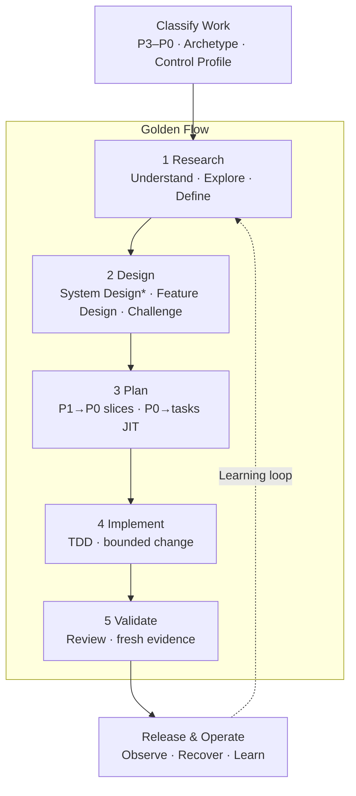

# AI-Native Software Engineering Framework — One-Page Overview

> Version: v1.1 Candidate  
> Status: Ready for Sponsor Review  
> Derived from: `02_Framework.md` v1.4 Baseline + `03_Golden_Engineering_Playbook.md` v1.2 Baseline  
> Purpose: Engineer and management visual entry point; supplement only

---

## The Operating Model

**一項工作只做四件事：正確分類、執行當前 stage、留下 minimum artifact、通過相稱的 human gate。**

`*` System Design：P3/P2 required；P1 risk-triggered；P0 normally skip。

- **Engineering Lifecycle**：Understand → Define → Design → Build → Verify → Release → Operate。
- **AI Work Loop in every stage**：Understand → Challenge → Execute → Evidence。

---

## 1. Classify Before Acting

| Decision | Choose | Determines |
|---|---|---|
| **Work Level** | P3 Product/Program → P2 Epic → P1 Feature → P0 PBI/User Story | Delivery decomposition、artifact depth、review owner |
| **Execution Layer** | Task → Plan Step → Commit（位於 P0 下方） | Implementation execution；不是 Work Level |
| **Archetype** | Greenfield · Legacy Modernization/Migration · Standard Delivery | Research/Design focus |
| **Control Profile** | System Criticality × L0–L3 Change Risk × E0–E3 AI Execution Mode | Rigor、authorization、evidence strength |

AI Execution Mode：**E0 Observe → E1 Propose → E2 Change → E3 Act**。

P0 types：**User Story · Engineering Story/Enabler · Bug · Spike**。每張 P0 都有 acceptance 與 `Blocked by`；無 blocker 的 P0 構成 execution frontier。Spike 以 evidence/decision outcome 驗證。

### System Design Trigger

| Level | System Design | Output / Handoff |
|---|---|---|
| **P3 Product / Program** | Required | Product/Target System Design → Epics or Migration Waves |
| **P2 Epic** | Required | Architecture Delta → Feature Map |
| **P1 Feature** | Triggered by cross-boundary/contract/data、重大 NFR、novel architecture、L2–L3 | System Design/ADR → Feature Design |
| **P0 PBI / Story** | Normally skip | Micro-design；architecture impact 則升級 |

System Design Review 是 **Change Gate 的 risk-based implementation**，不是第四個 universal gate。

---

## 2. Golden Stage Contract

| Stage | Lead Capability / Action | Minimum Artifact | Human Gate |
|---|---|---|---|
| **Research** | `understand-anything` · `codebase-research` · `grill-me` · `/opsx:explore` | Research / Understanding Brief | **Understanding Gate**：current state、problem、scope、unknowns 清楚 |
| **Design** | Triggered `system-design` · `superpowers:brainstorming` · `/opsx:propose` · `grill-with-docs` | System Design Pack when triggered + Feature Design / OpenSpec proposal/specs/design | **Change Gate**：design、risk、decomposition 可接受 |
| **Plan** | `to-tickets`：P1 → P0；triggered `writing-plans`：單一 P0 → tasks | P0 backlog + blockers；JIT executable plan when needed | **Change Gate**：slices 獨立可驗證、plan bounded |
| **Implement** | `/opsx:apply` + worktree + TDD + execution skill | Code/config/migration + tests + task ledger | Plan compliance + targeted verification |
| **Validate** | Code review · `/opsx:verify` when applicable · `verification-before-completion` | Validation Record / PR evidence | **Evidence Gate**：claims 有 fresh evidence |

---

## 3. Capability Responsibility

| Capability Layer | Owns | Does Not Own |
|---|---|---|
| **Understand / Research skills** | Domain、system、codebase 與 tacit knowledge evidence | Change authorization |
| **OpenSpec** | Durable change agreement：proposal → specs → design → tasks → apply → verify/sync/archive | Engineering judgment 或 TDD discipline |
| **Delivery decomposition** | `to-tickets` 將 approved P1 切成 P0 tracer bullets、blockers、frontier | P0 implementation details |
| **Superpowers** | Brainstorming、per-P0 JIT planning、TDD、execution、debugging、review、verification discipline | Product/architecture SSOT |
| **Human Owner** | Direction、trade-offs、authorization、risk acceptance、release decision | Delegating accountability to AI |

SSOT rule：P3/P2 architecture 存在 Product/Architecture artifacts；OpenSpec Change 是 P1/P0 scope-dependent container，引用或記錄 bounded delta。`/opsx:explore` 維持 E0/no-stakes。

---

## 4. Three Gates, One Accountability Model

| Gate | Core Question | Typical Evidence |
|---|---|---|
| **Understanding Gate** | 是否理解正確的系統與問題？ | Research Brief、code/runtime evidence、facts/unknowns |
| **Change Gate** | System/Feature Design 與 plan 是否合理、安全、可驗證？ | System Design Pack、ADR、spec/design、tasks、review record |
| **Evidence Gate** | 是否有足夠 evidence 可以完成與 release？ | Tests、review closure、NFR/risk evidence、release/recovery readiness |

所有 work 都維持三項 Universal Controls：**Clear Intent · Human Accountability · Risk-based Evidence**。

---

## Engineer Start in 60 Seconds

1. 選 P3/P2/P1/P0、P0 type、Archetype、Control Profile。
2. 找到第一個還不能回答的 stage question。
3. 只執行該 stage 的下一個 capability/action。
4. 將結果留在既有 ticket、OpenSpec、ADR、PR、test report 或 dashboard。
5. 由 accountable human 通過相稱 gate，再進下一步。

Tracker reference：Azure DevOps `Feature → PBI/Story → Task → PR/Commit`；GitLab `Child Epic/type::feature → Issue → child task/checklist → MR`。Milestone/Iteration 是 planning dimension，不是 hierarchy。

> **Outcome：更快理解正確的問題、做出更好的 engineering decision，並用足夠 evidence 安全交付。**
