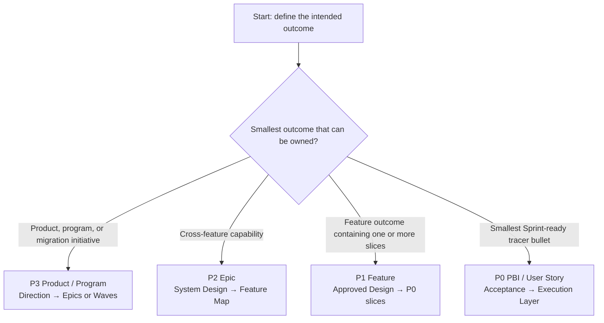
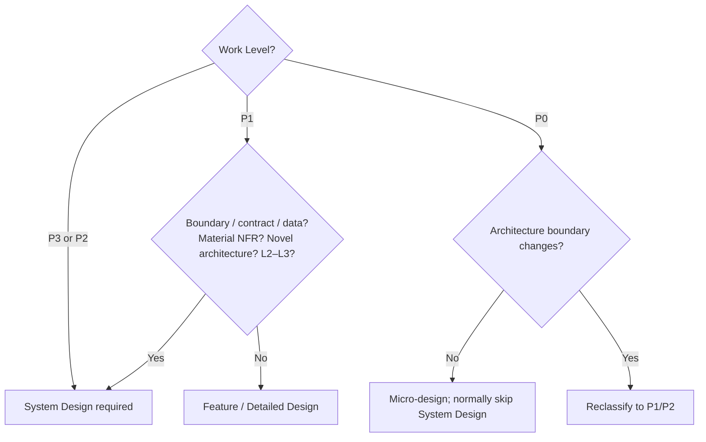
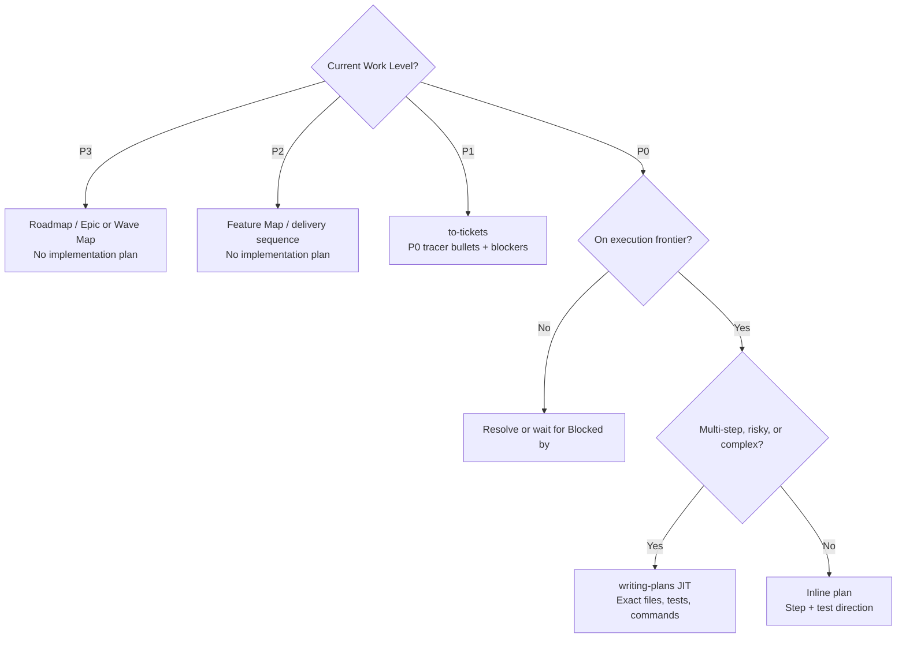

# AI-Native Software Engineering Decision Tree

> Version: v1.1 Candidate  
> Status: Ready for Sponsor / Engineering Review  
> Derived from: `02_Framework.md` v1.4 Baseline + `03_Golden_Engineering_Playbook.md` v1.2 Baseline + `04_Framework_Overview.md` v1.2 Candidate  
> Purpose: Engineer routing guide; supplement only

---

## Start Here — 60-Second Router

對一項工作，依序回答：

1. **Work Level 是什麼？** P3、P2、P1 或 P0；Task 不是 Work Level。
2. **Archetype 是什麼？** Greenfield、Modernization/Migration 或 Standard Delivery。
3. **Control Profile 是什麼？** System Criticality × Change Risk Tier × AI Execution Mode。
4. **Current Stage 是什麼？** 第一個還不能回答的 Golden Stage。
5. **Next Move 是什麼？** 只執行一個 lead skill/action，留下 minimum artifact，交給相稱的 human gate。

| First unanswered question | Route now | Next action | Detail |
|---|---|---|---|
| 現況、problem、scope 或 root cause 不清楚 | **Research** | 選一個 evidence skill；先通過 Understanding Gate | §6 |
| Boundary、target behavior、trade-off 或 failure mode 未決 | **Design** | Triggered System Design／brainstorming／grill | §5–6 |
| Approved outcome 尚未成為可執行 slices/steps | **Plan** | P1 用 `to-tickets`；單一 P0 按需 `writing-plans` | §6–7 |
| P0 與 plan ready | **Implement** | TDD + bounded execution + targeted checks | §6 |
| Need completion/release evidence | **Validate** | Review + fresh verification；再走 Release/Operate overlay | §6、§9 |

每次 routing 應得到一張簡短結果卡：

```text
Work Level / P0 Type:
Archetype:
Change Risk / AI Execution Mode:
System Design: Required / Triggered / Normally Skip
Current Stage:
Next Skill / Action:
Minimum Artifact:
Human Gate / Owner:
Release / Operate Handoff:
```

Artifact 可以留在既有 ticket、OpenSpec、ADR、PR、test report 或 dashboard；不要求為 Decision Tree 建立新表單。

---

## 1. Route Work Level



| If the work is… | Choose | First required move | Do not do |
|---|---|---|---|
| Product direction、large platform initiative、modernization/migration | **P3 Product / Program** | Establish Product/Program Brief、architecture direction、Epic/Wave map | Directly plan files or code |
| End-to-end capability spanning multiple Features | **P2 Epic** | Research impact；System Design；produce Feature Map | Create an Epic-wide implementation plan |
| Feature outcome that may contain one or more Sprint slices；可被整體驗收/release/control | **P1 Feature** | Research + approved Feature Design；then `to-tickets` | Split by technical layer |
| Smallest narrow-but-complete Sprint tracer bullet with independent evidence | **P0 PBI / User Story** | Confirm type、acceptance、`Blocked by`、Current Stage | Treat Task as P0 |
| File edit、test step、implementation action、commit | **Execution Layer** | Attach it to one P0 | Promote it into a Work Level |

Hierarchy：

```text
P3 Product / Program
└─ P2 Epic
   └─ P1 Feature
      └─ P0 PBI / User Story
         └─ Execution Layer: Task / Plan Step / Commit
```

---

## 2. Route P0 Type

Only run this router after confirming the work is a P0 vertical slice.

| Primary outcome | P0 Type | Required evidence | Lead path |
|---|---|---|---|
| User or business behavior | **User Story** | Demo + acceptance evidence | Targeted Research → Design → Plan → TDD → Validate |
| Technical capability、testability、platform runway、behavior-preserving improvement | **Engineering Story / Enabler** | Technical outcome + affected-quality evidence | Characterize → bounded design → TDD/refactor → verify |
| Incorrect behavior | **Bug** | Reproduction + proven root cause + regression evidence | `systematic-debugging` → regression test → minimal fix |
| Unknown or risk must be reduced before commitment | **Spike** | Time-boxed findings、reproducible evidence、decision/next action | Research/experiment only；production work becomes a new P1/P0 |

P0 readiness rules：

- 每張 P0 寫明 acceptance criteria 與 `Blocked by`。
- 沒有 blocker 的 P0 形成 **execution frontier**。
- 一般 P0 必須 demoable、independently verifiable；Spike 以 evidence/decision outcome 驗證。
- 不能獨立驗證時，回到 P1 `to-tickets` 重新 slicing。

---

## 3. Route Archetype

| Situation | Archetype | Research emphasis | Start with |
|---|---|---|---|
| New product/system，problem、domain、boundary 或 MVP 未定 | **Greenfield** | Users/workflow、domain、constraints、options、architecture runway | `grill-me` + `understand-anything`；模糊時 `/opsx:explore` |
| Legacy replacement、platform migration、data/runtime movement | **Modernization / Migration** | As-is behavior、hidden rules、dependencies、data、compatibility、recovery | `understand-anything` + `codebase-research` + `grill-me`；characterization first |
| Existing product boundary 內的 Feature、Bug、Enabler、automation | **Standard Delivery** | Current behavior、existing pattern、change boundary、acceptance | Targeted `codebase-research`；Bug 加 `systematic-debugging` |

Archetype 只改變 Research/Design emphasis，不建立新的 lifecycle 或 gate。

---

## 4. Route Control Profile

```text
Control Profile = System Criticality × Change Risk Tier × AI Execution Mode
```

### 4.1 Change Risk Tier

使用最高 material risk，不用 code size 或平均值判定。

| If failure would… | Tier | Route to |
|---|---|---|
| Have no durable/shared behavior impact；easy to redo | **L0** | Lightweight artifact + owner self-check |
| Affect one bounded component；known pattern；reversible | **L1** | Standard design note、review、risk-relevant tests |
| Cross component/contract/data/architecture；high uncertainty or recovery cost | **L2** | Written design、independent review、risk-specific evidence、controlled rollout when affected |
| Touch critical control path、irreversible state、security/safety control or large blast radius | **L3** | Accountable architecture/domain owner、full affected-risk evidence、operational readiness、verified recovery where feasible |

System Criticality can raise the minimum Tier when the change touches critical runtime decisions、shared dependencies、production data state or recovery mechanisms。

### 4.2 AI Execution Mode

| Highest AI action | Mode | Required authorization |
|---|---|---|
| Read、search、analyze only | **E0 Observe** | Owner checks understanding |
| Draft design/plan/patch only；do not apply | **E1 Propose** | Human selects direction and execution scope |
| Modify authorized workspace and run verification | **E2 Change** | Human reviews actual diff、tests、residual risk |
| Affect shared/external/production state | **E3 Act** | Existing authorized owner explicitly approves；observation + recovery control |

Tier controls engineering rigor；Execution Mode controls authorization。不要用其中一個取代另一個。

---

## 5. Route System Design



When required/triggered：

```text
Research Evidence
→ system-design capability bundle
→ Architecture Options / Selected Design
→ grill-with-docs
→ System Design Pack + ADRs + Decomposition
→ System Design Review under Change Gate
```

System Design stays inside **Design**。System Design Review 是 Change Gate 的 risk-based implementation，不是第四個 universal gate。

---

## 6. Route Current Stage to the Next Move

找出第一個無法可靠回答的問題；從那一列開始。不要一次啟動所有 skills。

| Current Stage | First unanswered question | Choose the lead skill/action | Minimum artifact | Human checkpoint |
|---|---|---|---|---|
| **Research** | Domain/system 全貌不清楚 | `understand-anything` | Knowledge/System Map + unknowns | Understanding Gate |
| **Research** | Existing code 真實 behavior、entry point、flow 不清楚 | `codebase-research` | Code Map + evidence links + change boundary | Understanding Gate |
| **Research** | 重要規則在 Owner/operator 腦中 | `grill-me` | Decisions、examples、assumptions、open questions | Understanding Gate |
| **Research** | 有 problem，但 option/scope/是否形成 change 未定 | `/opsx:explore` | Conversation findings only；E0/no durable artifact | Stop，或交給 proposal/Research Brief |
| **Research** | Bug/incident root cause 未證明 | `systematic-debugging` | Reproduction、hypotheses、falsification、root cause | Understanding Gate |
| **Design** | P3/P2 或 triggered P1 的 system boundary/interaction 未定 | `system-design` bundle | System Design Pack + ADRs | System Design Review under Change Gate |
| **Design** | Target behavior/options/trade-offs 未定 | `superpowers:brainstorming` | Approved Feature/Detailed Design | Change Gate |
| **Design** | Design/spec 已有，但可能有 contradiction/gap | `grill-with-docs` | Findings + closed decisions | Change Gate |
| **Design** | 需要 durable P1/P0 agreement | `/opsx:propose` or `/opsx:new` + `/opsx:continue` | Scoped proposal/specs/design/tasks | Change Gate |
| **Plan** | Approved P1 尚未切成 Sprint-ready slices | `to-tickets` | P0 tracer bullets + acceptance + `Blocked by` | Change Gate：slices independently verifiable |
| **Plan** | 單一 P0 即將執行；multi-step/high-risk/complex | `superpowers:writing-plans` | Exact files/interfaces/tests/commands | Change Gate：plan executable |
| **Plan** | 單一 P0 為 simple/low-risk/one-step | Inline plan | Steps + test direction | Owner/Reviewer check |
| **Implement** | P0 與 plan ready | `/opsx:apply` when used + worktree + TDD + execution skill | Code/config/migration + tests + task state | Per-step targeted verification |
| **Implement** | Unexpected failure/root cause unknown | Stop random patch；`systematic-debugging` | Proven cause + targeted correction | Reviewer check |
| **Validate** | Need review and completion evidence | Code review + `verification-before-completion`；risk-based `/opsx:verify` | PR / Validation Record + fresh commands | Evidence Gate |
| **Validate** | Change verified and durable truth must close | `/opsx:sync` → `/opsx:archive` when OpenSpec is used | Updated specs + archived Change | Owner accepts closure |

### Release / Operate Overlay

This is the handoff after Validate；它不新增 Golden Stage。

| After Evidence Gate | Next action | Minimum artifact | Accountable owner |
|---|---|---|---|
| No shared/production state change | Close P0/Feature；sync/archive OpenSpec when used | Validation / Closure Record | Work Owner |
| Will affect shared/external/production state | Enter existing release/change process；E3 authorization、rollout、rollback/recovery、observation | Release Readiness + Observation Record | Authorized Service / Release Owner |

---

## 7. Plan Decision Tree



Planning rules：

- `to-tickets` owns **P1 → P0 delivery decomposition**。
- `writing-plans` owns **one P0 → Execution Layer**，並採 just-in-time。
- 不替整個 Epic/Feature 預先建立巨大 implementation plan。
- Wide refactor 使用 `expand → migrate batches → contract`；每批是可驗證 P0，並標明 blocker。
- OpenSpec `tasks.md` 達到相同 plan standard 時直接引用/使用，不建立第二份 plan。

---

## 8. Route OpenSpec

| Question | If Yes | If No |
|---|---|---|
| 仍在 no-stakes option/scope exploration？ | `/opsx:explore`；保持 E0、no artifact、no code | Assess whether durable agreement is needed |
| 已決定形成 change，且需要 durable behavior agreement、handoff 或 maintained spec？ | Create a scoped OpenSpec Change | Keep ticket/ADR/PR chain as SSOT |
| Scope 是 coherent P1 Feature？ | P1 proposal/spec/design；`tasks.md` 記錄/引用 P0 ticket set and dependencies | Check whether scope is P0 |
| Scope 是需要 durable agreement 的 P0？ | P0 proposal/spec/design；`tasks.md` 可承載 Execution Layer steps | Reclassify scope before creating Change |
| OpenSpec plan 與 `writing-plans` output 重複？ | Keep one SSOT；補強或引用 | Proceed with the single existing plan SSOT |

P3/P2 architecture 存在 Product/Architecture SSOT；OpenSpec 只引用或記錄 bounded P1/P0 delta。

---

## 9. Gate Check

| Gate | Stop when… | Pass when… |
|---|---|---|
| **Understanding Gate** | Current behavior、problem、boundary 或 unknowns 仍靠猜測 | Evidence supports current state、scope、acceptance、next stage |
| **Change Gate** | Design decision unresolved；P0 slices not independent；plan not executable | Selected design/risk accepted；P0 decomposition and triggered plan are bounded/testable |
| **Evidence Gate** | Completion claim 只來自 AI summary；material findings/open risks 未處理 | Fresh evidence covers acceptance and affected risks；accountable owner accepts release/closure |

Gates 可以由現有 ticket、design review、PR、pipeline 或 release process 承載；不強制新增會議。

---

## 10. Final Routing Rules

1. **First unknown wins**：從第一個不能可靠回答的 stage 開始。
2. **One lead action at a time**：不要一次跑全部 skills。
3. **Evidence before confidence**：AI explanation 不是 completion evidence。
4. **Task stays below P0**：Task、Plan Step、Commit 都是 Execution Layer。
5. **No giant plans**：P1 先 `to-tickets`；單一 P0 才按需 `writing-plans`。
6. **Explore stays ephemeral**：`/opsx:explore` 不建立 Change 或 code。
7. **Release stays accountable**：Evidence Gate 後，shared/production action 走 E3 與既有 release process。
8. **Human owns the decision**：direction、trade-off、risk acceptance、release 都由 accountable human 決定。

> **Outcome：Engineer 能從目前狀態直接找到下一個 skill、artifact 與 human gate。**

---

## Appendix A — Fast Routes

### New Feature

```text
P1 Feature
→ codebase-research / explore if fuzzy
→ triggered system-design when needed
→ brainstorming / scoped OpenSpec design
→ grill-with-docs → approve design
→ to-tickets → P0 slices + Blocked by
→ each frontier P0: inline or JIT writing-plans
→ TDD / implement / review / fresh verification
→ Feature evidence rollup → Release/Operate overlay
```

### Bug

```text
P0 Bug
→ reproduce
→ systematic-debugging
→ proven root cause + failing regression test
→ confirm acceptance + Blocked by
→ inline plan or writing-plans if complex
→ minimal TDD fix
→ review + fresh verification → closure or Release/Operate overlay
```

### Legacy Modernization / Migration

```text
P3 Modernization / Migration
→ as-is research + behavior catalog + characterization baseline
→ target System Design + migration/recovery design
→ Wave Map → P2 Epics → P1 Features
→ to-tickets
→ expand → migrate batches → contract P0s
→ parity / reconciliation / cutover evidence
→ E3 release authorization + observation/recovery
```

---

## Appendix B — Tracker Reference

| Framework | Azure DevOps | GitLab |
|---|---|---|
| P3 Product / Program | Portfolio / Roadmap context | Top-level Epic / Group Roadmap |
| P2 Epic | Epic | Epic |
| P1 Feature | Feature | Child Epic or team convention `type::feature` |
| P0 PBI / User Story | PBI / User Story / Bug | Issue with story / enabler / bug / spike type or label |
| Execution Layer | Task | Task child item or checklist |
| Implementation | Branch / PR / Commit | Merge Request linked to P0 Issue |
| Release / Sprint | Existing release/sprint construct | Milestone / Iteration |

Milestone/Iteration 是 planning dimension，不是 hierarchy。Tracker 只映射 Framework semantics，不重新定義 Work Level。
