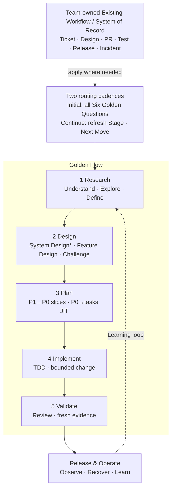

# AI-Native Software Engineering Framework — One-Page Overview

> Version: v1.10 Candidate
> Status: Ready for Sponsor Review  
> Derived from: `02_Framework.md` v1.11 Baseline + `03_Golden_Engineering_Playbook.md` v1.9 Baseline
> Purpose: Engineer and management visual entry point; supplement only

---

## The Operating Model

**新工作先完成 Six Golden Questions；進入執行後，只更新 Current Stage 與 Next Move。**

Golden Stages 是 portable engineering decision states，不是所有 Team 必須採用的固定 SDLC phases。Team 擁有 local activities、artifact placement 與 templates；Department 擁有 minimum contract 與 quality bar。

`*` System Design：P3/P2 required；P1 risk-triggered；P0 normally skip。

- **AI 基本功 in every Golden Stage**：先 Understand、Challenge，再 Execute 並留下 Evidence；它不是第二套 lifecycle。

---

## 1. Classify the Work, Then Choose the Next Move

進入新 work item 時，先確認工作記在哪裡，並判斷工作規模、工作類型與控制強度；再決定 Current Stage 與 Next Move。進入執行後沿用已確認的 context，只更新 Current Stage 與 Next Move；scope、architecture、risk 或 AI authority 改變時再完整重判。

| 要判斷什麼 | 選項 | 會影響什麼 |
|---|---|---|
| **工作規模（Work Level）** | P3 Product/Program → P2 Epic → P1 Feature → P0 PBI/User Story | 誰負責 outcome、如何拆解、需要多完整的 artifact 與 review |
| **工作類型（Archetype）** | Greenfield · Modernization/Migration · 一般既有系統變更 | Research／Design 應先釐清 problem/domain、as-is/compatibility，或 bounded change context |
| **控制強度（Control Profile）** | System Criticality × L0–L3 Change Risk × E0–E3 AI Execution Mode | Human approval、AI authority 與所需 evidence 強度 |

Execution Layer 的 Task → Plan Step → Commit 位於 P0 下方，不是另一個 Work Level。AI Execution Mode 是 **E0 Observe → E1 Propose → E2 Change → E3 Act**。

P0 types：**User Story · Engineering Story/Enabler · Bug · Spike**。每張 P0 都有 acceptance 與 `Blocked by`；無 blocker 的 P0 構成 execution frontier。Spike 以 evidence/decision outcome 驗證。

**System Design trigger**：P3/P2 required；P1 在 cross-boundary/contract/data、重大 NFR、novel architecture 或 L2–L3 時 triggered；P0 normally skip，architecture impact 則升級。System Design Review 是 **Change Gate implementation**，不是新 gate。

---

## 2. Golden Stage Contract

| Stage | Required Capability / Golden Defaults | Minimum Artifact | Human Gate |
|---|---|---|---|
| **Research** | Evidence-backed understanding；defaults：manual `system-research` · manual `codebase-research`；按未知加 `grill-me` · `/opsx:explore` | Research / Understanding Brief | **Understanding Gate**：current state、problem、scope、unknowns 清楚 |
| **Design** | Perform/select/challenge design；System Design when triggered；`superpowers:brainstorming` when target behavior/approach is not approved；`grill-me` supports tacit decisions；`grill-with-docs` challenges artifacts；OpenSpec when change context must survive handoff | System Design Pack when triggered + Feature Design / OpenSpec proposal/specs/design | **Change Gate**：design、risk、decomposition 可接受 |
| **Plan** | Delivery/JIT decomposition；defaults：`to-tickets` P1 → P0；triggered `writing-plans` P0 → tasks | P0 backlog + blockers；JIT executable plan when needed | **Change Gate**：slices 獨立可驗證、plan bounded |
| **Implement** | TDD-driven bounded execution；primary discipline：`superpowers:test-driven-development`，搭配 worktree + execution skill；OpenSpec change 使用 `/opsx:apply` 作為 execution entry | Code/config/migration + tests + task ledger | Plan compliance + targeted verification |
| **Validate** | Independent review + fresh verification；defaults：`requesting-code-review` → `receiving-code-review` → `verification-before-completion`；OpenSpec 按 risk 加 `/opsx:verify` | Validation Record / PR evidence | **Evidence Gate**：claims 有 fresh evidence |

---

## 3. Capability Map by Golden Stage

先看責任分工，再看 skill 出現在哪個 Stage。兩張表回答的是不同問題：Responsibility Map 決定誰擁有結果；Stage Map 幫 Engineer 找到下一個可用能力。

| Responsibility | Department Default | 實際角色 |
|---|---|---|
| **Direction／roles** | Existing Team workflow and owners | 決定 outcome、scope、trade-off、risk acceptance 與 production authority |
| **Spec-Driven Development** | **OpenSpec** | 維護 durable proposal／specs／design／tasks、implementation alignment 與 change traceability |
| **Engineering discipline** | **Superpowers／Team equivalent** | 落實 design/planning discipline、worktree、TDD、debugging、review 與 fresh verification |
| **Execution orchestration** | `/opsx:apply`、Superpowers execution skill 或 approved runner | 每個 change 一個 execution entry、一個 task ledger |
| **Evidence／approval** | CI、PR、tests、review、OpenSpec verify + Human Gate | Automation 提供 evidence；Human Owner 決定 pass／rework／risk acceptance |

> **OpenSpec owns Spec-Driven Development and change traceability. Superpowers enforces TDD-centered engineering disciplines.**

| Capability Family | Research | Design | Plan | Implement | Validate |
|---|---|---|---|---|---|
| **Department Engineering** | `system-research` · `codebase-research` | System Design when triggered | Work Level decomposition policy | Engineering quality bar | Human Gate · evidence acceptance |
| **Matt Pocock Skills** | `grill-me` | `grill-me` for tacit decisions · `grill-with-docs` · `improve-codebase-architecture` | `to-tickets`：P1 → P0 | — | `grill-with-docs` for artifact consistency |
| **OpenSpec** | `/opsx:explore` | `/opsx:propose` or `/opsx:new` + `/opsx:continue` | `tasks.md`／ticket references | `/opsx:apply` | `/opsx:verify → /opsx:sync → /opsx:archive` |
| **Superpowers** | `systematic-debugging` for bugs/incidents | `brainstorming` | `writing-plans` per P0 | `using-git-worktrees` · `test-driven-development` · execution skills · `systematic-debugging` on failure | `requesting-code-review` · `receiving-code-review` · `verification-before-completion` · branch completion |

這張 Matrix 表示各 Stage 可選用的能力，**不是每個 work item 都要執行每一格**；依 Current Stage、主要未知與風險選擇 Next Move。

### Quick Choice

| 要做什麼已清楚？ | 後續需要跨 session／AI／Engineer 接手？ | 建議路徑 |
|---|---|---|
| **否** | 尚未判斷 | 先處理未知：系統不清楚用 research、人的決定不清楚用 `grill-me`、change/options/scope 不清楚用 `/opsx:explore` |
| **是** | **否** | **Superpowers／Team equivalent**：short design／`brainstorming` → inline plan 或 `writing-plans` → TDD → request/receive code review → verification |
| **是** | **是** | **OpenSpec + selected Superpowers disciplines**：OpenSpec 擁有 why／what／how／tasks 與 `/opsx:apply` entry；TDD、debugging、request/receive code review、verification 確保執行品質；design/plan 只留一份 SSOT |

OpenSpec 管 spec-driven agreement；Superpowers 管 engineering disciplines。兩者都有跨 Stage 能力：OpenSpec 可以 apply／verify，Superpowers 可以 design／plan。責任分工不是說哪個工具只能出現在哪個 Stage，而是說 mixed mode 時誰擁有 artifact、誰約束 execution quality。

Team 可依既有 workflow、工具可用性、熟悉度與交接頻率選 **Fast Delivery 或 Complex/Durable Change** default route，也可使用 approved equivalent。這是全隊共同 convention，不是個人臨時偏好；architecture/risk trigger、required design/test/review、Human Gate 與 evidence 不可降低。

| Route | 何時用 | 主路徑 |
|---|---|---|
| **Fast Delivery** | 要做什麼清楚、bounded P0/P1、ticket + PR 已足以延續 | Superpowers／Team equivalent：short design → plan as needed → TDD → review → verification |
| **Complex / Durable Change** | why／what／how／tasks 必須跨 session／人／AI 延續，或 behavior contract 要長期維護 | OpenSpec proposal/specs/design/tasks → Change Gate → `/opsx:apply`；每個 task 用 Superpowers TDD/debugging/review/verification → `/opsx:verify` → Evidence Gate → sync/archive |

若 problem、current behavior、root cause 或 options 尚未清楚，先以 research／`grill-me`／`/opsx:explore`／debugging 處理第一個未知，再回來選上面兩條。Discovery 是 pre-route，不是第三條 delivery flow。

若 OpenSpec 與 upstream Superpowers 一起使用，Team 必須先核准 artifact integration：使用 reviewed custom schema／bridge，或由 OpenSpec 擁有 proposal/specs/design/tasks、Superpowers 只負責不重複建文件的 TDD/debugging/review/verification。每個 change 只保留一個 spec/design owner、一個 plan/task ledger 與一個 execution entry。

SSOT rule：P3/P2 architecture 存在 Product/Architecture artifacts；OpenSpec Change 是 P1/P0 scope-dependent container，引用或記錄 bounded delta。`/opsx:explore` 維持 E0/no-stakes。

Verification boundary：`/opsx:verify` 與 CLI `openspec validate` 檢查 artifact/implementation alignment 或 artifact validity；**不取代 TDD、code review、runtime/NFR tests 或 release evidence**。

Code review 的 stage ownership 在 **Validate**；但 `requesting-code-review` 可在 Implement 的每個 task/checkpoint 後提早執行。`receiving-code-review` 先驗證 feedback；需要改 code 時回到 Implement，修正與測試後再進 Validate。

---

## 4. Three Human Decisions Before Moving Forward

| Checkpoint | 何時發生 | Human 必須確認 | Minimum Evidence | 通過後 |
|---|---|---|---|---|
| **Understanding** | Research → Design 前 | Problem、current state、scope 與重要 unknown 已清楚 | Work item context／Research Brief | 可以開始 Design |
| **Change** | Design／Plan → Implement 前 | 要改什麼、風險、P0 slices 與必要 plan 可以接受 | Approved design/spec、P0 backlog、必要 ADR／plan | 授權開始 Implement |
| **Evidence** | Implement → Done／Release 前 | Acceptance 已滿足，重要風險有 fresh verification evidence | Code review、test result、Validation Record | 可以宣稱完成或進入 Release |

### Gate Decision Record

每個 Checkpoint 都必須留下可追溯的 **Human Decision Record**；通過時即構成 approval，未通過則記錄 required rework。

| Gate | Record Location |
|---|---|
| **Understanding** | Work item／Ticket／PBI／Story |
| **Change** | Design／RFC／OpenSpec，並由 Work Item 引用 |
| **Evidence** | PR／Validation Record |
| **Production Release** | 既有 Release／Change Management record |

Minimum record：**Decision（Pass／Conditional Pass／Rework）· Accountable Human Owner · decision time · reviewed scope/artifact version · evidence links · conditions/accepted risks**。

Gate decision 記錄在授權下一個動作的 existing System of Record；不建立獨立 Gate 文件或新流程。AI 可以準備 recommendation 與 evidence，但不能成為 approver。

---

## Engineer Start in 60 Seconds

1. **Initial route**：新工作完整回答 Six Golden Questions。
2. **Next Move**：先處理第一個還沒搞清楚的問題；只選一個最適合的 capability，留下 minimum evidence，由 accountable owner 完成 gate decision。
3. **Continue route**：執行中更新 Current Stage／Next Move；context 改變時完整重判。

Research 的 manual defaults 不需安裝，candidate implementation 核准後才可取代。其他 Golden defaults／Team equivalents 仍需完成 capability、input/output、stop condition、gate 與 evidence mapping。

Tool/tracker routing details：see `05_Decision_Tree`。

> **Outcome：更快理解正確的問題、做出更好的 engineering decision，並用足夠 evidence 安全交付。**
