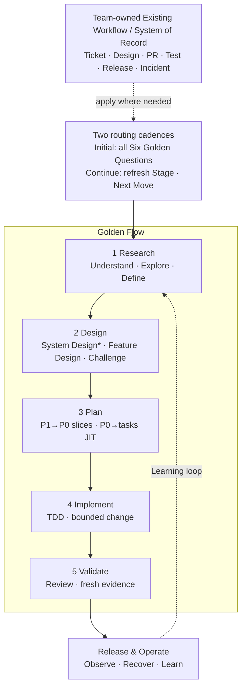

# AI-Native Software Engineering Framework — One-Page Overview

> Version: v1.7 Candidate
> Status: Ready for Sponsor Review  
> Derived from: `02_Framework.md` v1.8 Baseline + `03_Golden_Engineering_Playbook.md` v1.6 Baseline
> Purpose: Engineer and management visual entry point; supplement only

---

## The Operating Model

**新工作先完成 Six Golden Questions；進入執行後，只更新 Current Stage 與 Next Move。**

Golden Stages 是 portable engineering decision states，不是所有 Team 必須採用的固定 SDLC phases。Team 擁有 local activities、artifact placement 與 templates；Department 擁有 minimum contract 與 quality bar。

`*` System Design：P3/P2 required；P1 risk-triggered；P0 normally skip。

- **AI 基本功 in every Golden Stage**：先 Understand、Challenge，再 Execute 並留下 Evidence；它不是第二套 lifecycle。

---

## 1. Classify the Work, Then Choose the Next Move

進入新 work item 時，先確認工作記在哪裡，並判斷工作規模、工作類型與控制強度；再決定 Current Stage 與 Next Move。進入執行後沿用已確認的 context，只更新 Current Stage 與 Next Move；scope、architecture、risk 或 AI authority 改變時再完整重判。

| 要判斷什麼 | 選項 | 會影響什麼 |
|---|---|---|
| **工作規模（Work Level）** | P3 Product/Program → P2 Epic → P1 Feature → P0 PBI/User Story | 誰負責 outcome、如何拆解、需要多完整的 artifact 與 review |
| **工作類型（Archetype）** | Greenfield · Modernization/Migration · 一般既有系統變更 | Research／Design 應先釐清 problem/domain、as-is/compatibility，或 bounded change context |
| **控制強度（Control Profile）** | System Criticality × L0–L3 Change Risk × E0–E3 AI Execution Mode | Human approval、AI authority 與所需 evidence 強度 |

Execution Layer 的 Task → Plan Step → Commit 位於 P0 下方，不是另一個 Work Level。AI Execution Mode 是 **E0 Observe → E1 Propose → E2 Change → E3 Act**。

P0 types：**User Story · Engineering Story/Enabler · Bug · Spike**。每張 P0 都有 acceptance 與 `Blocked by`；無 blocker 的 P0 構成 execution frontier。Spike 以 evidence/decision outcome 驗證。

**System Design trigger**：P3/P2 required；P1 在 cross-boundary/contract/data、重大 NFR、novel architecture 或 L2–L3 時 triggered；P0 normally skip，architecture impact 則升級。System Design Review 是 **Change Gate implementation**，不是新 gate。

---

## 2. Golden Stage Contract

| Stage | Required Capability / Golden Defaults | Minimum Artifact | Human Gate |
|---|---|---|---|
| **Research** | Evidence-backed understanding；defaults：manual `system-research` · manual `codebase-research`；按未知加 `grill-me` · `/opsx:explore` | Research / Understanding Brief | **Understanding Gate**：current state、problem、scope、unknowns 清楚 |
| **Design** | Perform/select/challenge design；System Design when triggered；按未知選 `grill-me`（tacit decisions）或 `grill-with-docs`（artifact challenge）；`/opsx:propose` for durable agreement | System Design Pack when triggered + Feature Design / OpenSpec proposal/specs/design | **Change Gate**：design、risk、decomposition 可接受 |
| **Plan** | Delivery/JIT decomposition；defaults：`to-tickets` P1 → P0；triggered `writing-plans` P0 → tasks | P0 backlog + blockers；JIT executable plan when needed | **Change Gate**：slices 獨立可驗證、plan bounded |
| **Implement** | TDD-driven bounded execution；primary discipline：`superpowers:test-driven-development`，搭配 worktree + execution skill；OpenSpec change 使用 `/opsx:apply` 作為 execution entry | Code/config/migration + tests + task ledger | Plan compliance + targeted verification |
| **Validate** | Independent code review + fresh verification；defaults：code review · `/opsx:verify` · `verification-before-completion` | Validation Record / PR evidence | **Evidence Gate**：claims 有 fresh evidence |

---

## 3. Capability Map by Golden Stage

| Capability Family | Research | Design | Plan | Implement | Validate |
|---|---|---|---|---|---|
| **Department Engineering** | `system-research` · `codebase-research` | System Design when triggered | Work Level decomposition policy | Engineering quality bar | Human Gate · evidence acceptance |
| **Matt Pocock Skills** | `grill-me` | `grill-me` for tacit decisions · `grill-with-docs` · `improve-codebase-architecture` | `to-tickets`：P1 → P0 | — | `grill-with-docs` for artifact consistency |
| **OpenSpec** | `/opsx:explore` | `/opsx:propose` or `/opsx:new` + `/opsx:continue` | `tasks.md`／ticket references | `/opsx:apply` | `/opsx:verify → /opsx:sync → /opsx:archive` |
| **Superpowers** | `systematic-debugging` for bugs/incidents | `brainstorming` | `writing-plans` per P0 | `using-git-worktrees` · `test-driven-development` · execution skills · `systematic-debugging` on failure | Code review · `verification-before-completion` · branch completion |

這張 Matrix 表示各 Stage 可選用的能力，**不是每個 work item 都要執行每一格**；依 Current Stage、主要未知與風險選擇 Next Move。

OpenSpec 維護 durable change agreement 與 lifecycle；Matt Pocock skills 強化 knowledge elicitation、artifact challenge 與 P1 → P0 decomposition；Superpowers 強化 P0 design、planning、TDD、execution、review 與 verification discipline。Human Owner 對 direction、trade-offs、authorization、risk acceptance 與 release accountable。

SSOT rule：P3/P2 architecture 存在 Product/Architecture artifacts；OpenSpec Change 是 P1/P0 scope-dependent container，引用或記錄 bounded delta。`/opsx:explore` 維持 E0/no-stakes。

---

## 4. Three Human Decisions Before Moving Forward

| Checkpoint | 何時發生 | Human 必須確認 | Minimum Evidence | 通過後 |
|---|---|---|---|---|
| **Understanding** | Research → Design 前 | Problem、current state、scope 與重要 unknown 已清楚 | Work item context／Research Brief | 可以開始 Design |
| **Change** | Design／Plan → Implement 前 | 要改什麼、風險、P0 slices 與必要 plan 可以接受 | Approved design/spec、P0 backlog、必要 ADR／plan | 授權開始 Implement |
| **Evidence** | Implement → Done／Release 前 | Acceptance 已滿足，重要風險有 fresh verification evidence | Code review、test result、Validation Record | 可以宣稱完成或進入 Release |

### Gate Decision Record

每個 Checkpoint 都必須留下可追溯的 **Human Decision Record**；通過時即構成 approval，未通過則記錄 required rework。

| Gate | Record Location |
|---|---|
| **Understanding** | Work item／Ticket／PBI／Story |
| **Change** | Design／RFC／OpenSpec，並由 Work Item 引用 |
| **Evidence** | PR／Validation Record |
| **Production Release** | 既有 Release／Change Management record |

Minimum record：**Decision（Pass／Conditional Pass／Rework）· Accountable Human Owner · decision time · reviewed scope/artifact version · evidence links · conditions/accepted risks**。

Gate decision 記錄在授權下一個動作的 existing System of Record；不建立獨立 Gate 文件或新流程。AI 可以準備 recommendation 與 evidence，但不能成為 approver。

---

## Engineer Start in 60 Seconds

1. **Initial route**：新工作完整回答 Six Golden Questions。
2. **Next Move**：執行一個 required capability，留下 minimum evidence，由 accountable owner 完成 gate decision。
3. **Continue route**：執行中更新 Current Stage／Next Move；context 改變時完整重判。

Research 的 manual defaults 不需安裝，candidate implementation 核准後才可取代。其他 Golden defaults／Team equivalents 仍需完成 capability、input/output、stop condition、gate 與 evidence mapping。

Tool/tracker routing details：see `05_Decision_Tree`。

> **Outcome：更快理解正確的問題、做出更好的 engineering decision，並用足夠 evidence 安全交付。**
