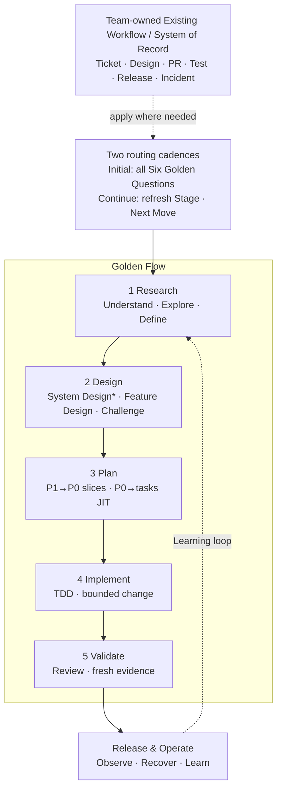

# AI-Native Software Engineering Framework — One-Page Overview

> Version: v1.6 Candidate
> Status: Ready for Sponsor Review  
> Derived from: `02_Framework.md` v1.8 Baseline + `03_Golden_Engineering_Playbook.md` v1.6 Baseline
> Purpose: Engineer and management visual entry point; supplement only

---

## The Operating Model

**新工作先完成 Six Golden Questions；進入執行後，只更新 Current Stage 與 Next Move。**

Golden Stages 是 portable engineering decision states，不是所有 Team 必須採用的固定 SDLC phases。Team 擁有 local activities、artifact placement 與 templates；Department 擁有 minimum contract 與 quality bar。

`*` System Design：P3/P2 required；P1 risk-triggered；P0 normally skip。

- **AI 基本功 in every Golden Stage**：先 Understand、Challenge，再 Execute 並留下 Evidence；它不是第二套 lifecycle。

---

## 1. Complete the Initial Route, Then Refresh What Changes

進入新 work item 時，先確認工作記在哪裡、Work Level、Archetype、Current Stage、Control Profile 與 Next Move。進入執行後沿用已確認的 context，只更新 Current Stage 與 Next Move；scope、architecture、risk 或 AI authority 改變時再完整重判。

| Trigger | Add This Context | Determines |
|---|---|---|
| 需要 delivery decomposition 或 artifact/review depth | **Work Level**：P3 Product/Program → P2 Epic → P1 Feature → P0 PBI/User Story | Outcome ownership、decomposition、review depth |
| Greenfield 或 migration/modernization 的 starting evidence 不同 | **Archetype** | Research／Design focus；一般 bounded work 不必重複標記 Standard |
| 高 criticality、L2–L3 change 或 shared/external action | **Control Profile**：Criticality × Risk × E0–E3 | Rigor、authorization、evidence strength |

Execution Layer 的 Task → Plan Step → Commit 位於 P0 下方，不是另一個 Work Level。AI Execution Mode 是 **E0 Observe → E1 Propose → E2 Change → E3 Act**。

P0 types：**User Story · Engineering Story/Enabler · Bug · Spike**。每張 P0 都有 acceptance 與 `Blocked by`；無 blocker 的 P0 構成 execution frontier。Spike 以 evidence/decision outcome 驗證。

**System Design trigger**：P3/P2 required；P1 在 cross-boundary/contract/data、重大 NFR、novel architecture 或 L2–L3 時 triggered；P0 normally skip，architecture impact 則升級。System Design Review 是 **Change Gate implementation**，不是新 gate。

---

## 2. Golden Stage Contract

| Stage | Required Capability / Golden Defaults | Minimum Artifact | Human Gate |
|---|---|---|---|
| **Research** | Evidence-backed understanding；defaults：manual `system-research` · manual `codebase-research`；按未知加 `grill-me` · `/opsx:explore` | Research / Understanding Brief | **Understanding Gate**：current state、problem、scope、unknowns 清楚 |
| **Design** | Perform/select/challenge design；System Design when triggered；AI skills optional · `/opsx:propose` for durable agreement | System Design Pack when triggered + Feature Design / OpenSpec proposal/specs/design | **Change Gate**：design、risk、decomposition 可接受 |
| **Plan** | Delivery/JIT decomposition；defaults：`to-tickets` P1 → P0；triggered `writing-plans` P0 → tasks | P0 backlog + blockers；JIT executable plan when needed | **Change Gate**：slices 獨立可驗證、plan bounded |
| **Implement** | Test-first bounded execution；defaults：`/opsx:apply` + worktree + TDD + execution skill | Code/config/migration + tests + task ledger | Plan compliance + targeted verification |
| **Validate** | Review + fresh verification；defaults：code review · `/opsx:verify` · `verification-before-completion` | Validation Record / PR evidence | **Evidence Gate**：claims 有 fresh evidence |

---

## 3. Capability Responsibility

| Capability | Owns |
|---|---|
| **Research skills** | Domain、system、codebase、tacit-knowledge evidence |
| **OpenSpec** | Scoped P1/P0 durable agreement and archive |
| **`to-tickets`** | Approved P1 → P0 tracer bullets、blockers、frontier |
| **Superpowers** | Design、per-P0 JIT planning、TDD、review、verification discipline |
| **Human Owner** | Direction、trade-offs、authorization、risk acceptance、release |

SSOT rule：P3/P2 architecture 存在 Product/Architecture artifacts；OpenSpec Change 是 P1/P0 scope-dependent container，引用或記錄 bounded delta。`/opsx:explore` 維持 E0/no-stakes。

---

## 4. Three Gates, One Accountability Model

| Gate | Pass evidence |
|---|---|
| **Understanding** | Current state、problem、scope、unknowns are evidence-backed |
| **Change** | Design、risk、P0 decomposition and triggered plan are acceptable |
| **Evidence** | Acceptance、affected risks、release/recovery claims have fresh evidence |

所有 work 都維持三項 Universal Controls：**Clear Intent · Human Accountability · Risk-based Evidence**。

---

## Engineer Start in 60 Seconds

1. **Initial route**：新工作完整回答 Six Golden Questions。
2. **Next Move**：執行一個 required capability，留下 minimum evidence，由 accountable owner 完成 gate decision。
3. **Continue route**：執行中更新 Current Stage／Next Move；context 改變時完整重判。

Research 的 manual defaults 不需安裝，candidate implementation 核准後才可取代。其他 Golden defaults／Team equivalents 仍需完成 capability、input/output、stop condition、gate 與 evidence mapping。

Tool/tracker routing details：see `05_Decision_Tree`。

> **Outcome：更快理解正確的問題、做出更好的 engineering decision，並用足夠 evidence 安全交付。**
