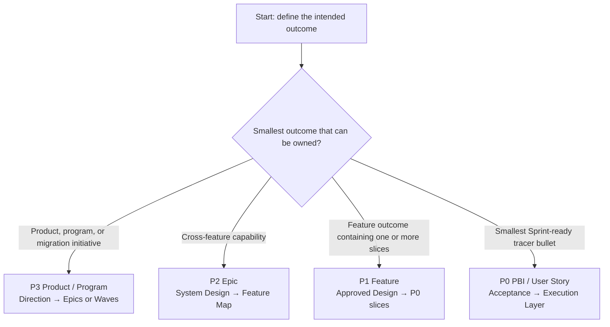
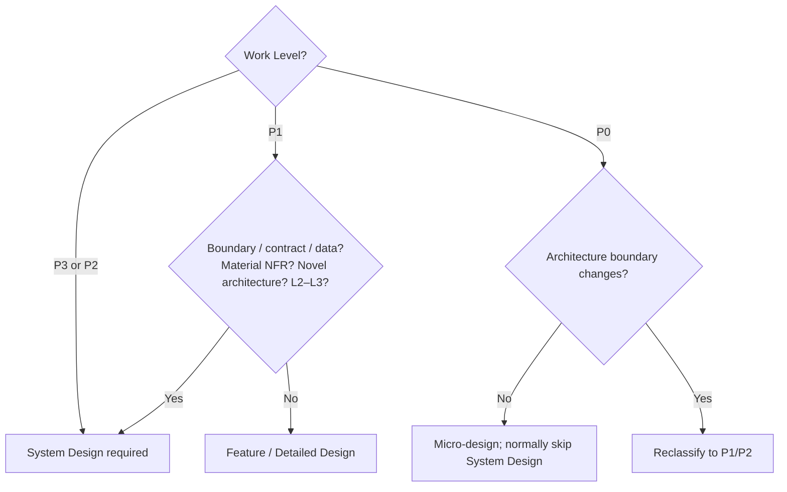
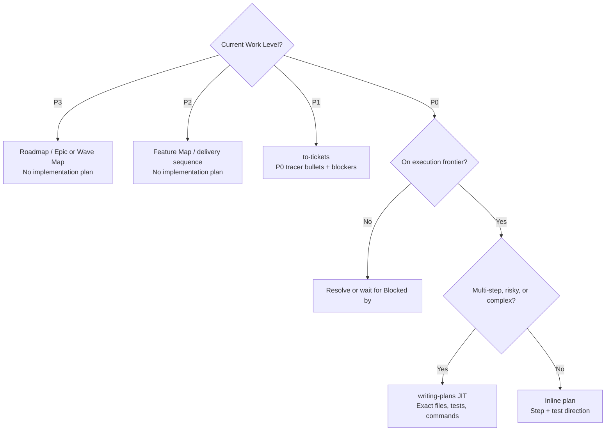

# AI-Native Software Engineering Decision Tree

> Version: v1.10 Candidate
> Status: Ready for Sponsor / Engineering Review  
> Derived from: `02_Framework.md` v1.11 Baseline + `03_Golden_Engineering_Playbook.md` v1.9 Baseline + `04_Framework_Overview.md` v1.10 Candidate
> Purpose: Detailed Engineer routing reference; opening router also serves as the daily quick reference

---

## Start Here — 60-Second Router

Routing 有兩個 cadence：

1. **Initial route**：進入新的 work item 時，完整回答 Six Golden Questions，確認工作記在哪裡、Work Level、Archetype、Current Stage、Control Profile 與 Next Move。
2. **Continue route**：執行中通常只更新 Current Stage 與 Next Move；scope、architecture、risk 或 AI authority 改變時，再完整重判六題。

Bounded P0 Bug 仍要在進場時確認它是 P0、Standard Delivery、相稱 risk/authority 與 current stage；只是進入 debugging／implementation loop 後，不必在每一步重複分類。

Golden Stages 是 portable engineering decision states，不是 Team 必須採用的固定 SDLC phases。一個 Refinement 可以同時承載 Research、Design、Plan；一個 PR 可以同時承載 Implement、Validate；Team 自主決定 local activity mapping。

每個 Stage 都使用同一組 **AI 基本功**：先 Understand、Challenge，再 Execute 並留下 Evidence。

| First unanswered question | Route now | Next action | Detail |
|---|---|---|---|
| 現況、problem、scope 或 root cause 不清楚 | **Research** | 選一個 evidence skill；先通過 Understanding Gate | §6 |
| Boundary、target behavior、trade-off 或 failure mode 未決 | **Design** | 依 trigger 進行 System Design；target approach 未 approved 時用 `brainstorming` 完成 Feature/Detailed Design | §5–6 |
| Approved outcome 尚未成為可執行 slices/steps | **Plan** | P1 用 `to-tickets`；單一 P0 按需 `writing-plans` | §6–7 |
| P0 與 plan ready | **Implement** | TDD + bounded execution + targeted checks | §6 |
| Need completion/release evidence | **Validate** | `requesting-code-review` → `receiving-code-review` → fresh verification；再走 Release/Operate overlay | §6、§9 |

每次 routing 只需得到一張簡短結果卡：

```text
工作記在哪裡（ticket / PR / doc / release record）:
Current Stage:
Required Capability:
Default Execution / Approved Equivalent:
為什麼選它／做到什麼就停:
Minimum Artifact:
結果放哪裡／下一步交給誰:
Human Gate / Owner:

Only if triggered:
Work Level / P0 Type:
Archetype:
Change Risk / AI Execution Mode:
System Design / Release Handoff:
```

Artifact 可以留在既有 ticket、OpenSpec、ADR、PR、test report、release/change record 或 dashboard；不要求為 Decision Tree 建立新表單。若既有 SSOT 已存在，reference rather than copy。

---

## Golden Matrix — Pick Work Level, Then Current Stage

使用方式：initial route 先用 Six Golden Questions 選定 **P3–P0 column**、Archetype、Control Profile 與目前最大未知所屬的 **Golden Stage row**；執行中沿用該 context，只依 Current Stage／Next Move 移動。cell 左側是 required engineering activity／supporting skill，箭頭右側是 minimum output。

| Golden Stage | P3 Product / Program | P2 Epic | P1 Feature | P0 PBI / User Story |
|---|---|---|---|---|
| **Research** | manual `system-research` + `grill-me` + `/opsx:explore` when fuzzy → Product/As-Is Research Brief、Domain/Workflow Map | manual `system-research` + `codebase-research` + `grill-me` → Epic Research Brief、Impact Map | manual `codebase-research`；fuzzy 時 `/opsx:explore` → Feature Research Brief、acceptance/risk context | manual `codebase-research`；Bug 加 `systematic-debugging` → P0 Context、reproduction/root cause、change boundary |
| **Design** | System Design → Product/Target System Design、ADRs、Epic/Wave boundaries；AI aids optional | System Design → Epic System Design、ADRs、Feature Map；AI aids optional | Triggered System Design；change context 必須交接時才加 scoped OpenSpec → Approved Feature Design/Spec | Micro-design；相同 handoff/maintenance 需求才加 OpenSpec → Selected Approach、must-not-change、test direction |
| **Plan** | Portfolio/roadmap decomposition → Product Roadmap、Epic/Wave Map、validation plan；**no implementation plan** | Feature decomposition/delivery planning → Feature Backlog、dependencies、integration evidence plan；**no implementation plan** | `to-tickets` → P0 tracer bullets、acceptance、`Blocked by`、execution frontier | Inline plan，或 triggered JIT `writing-plans` → Tasks、exact files/interfaces/tests/commands |
| **Implement** | Execute via P2/P1/P0 playbooks → Working product/wave increments、decision/evidence ledger | Execute via P1/P0 playbooks → Feature increments、contract/integration tests | Execute frontier P0s；each uses P0 Playbook → P0 increments、tests、ticket state | worktree + TDD + execution skill；OpenSpec change 由 `/opsx:apply` 讀取 tasks → Code/config/migration、tests、task state |
| **Validate** | Product/migration review + verification → Product/Migration Validation、NFR/operation/cutover readiness | E2E review + verification → Epic Validation、contract/NFR/rollout evidence | P0 evidence rollup + request/receive code review + verification；risk-based `/opsx:verify` → Feature Validation Record | `requesting-code-review` → `receiving-code-review` → `verification-before-completion` → PR/P0 Validation、closure or Release/Operate handoff |

Matrix rules：

- System Design：P3/P2 required；P1 risk-triggered；P0 normally skip，architecture impact 則升級。
- Plan 不可跨層：P3/P2 做 delivery decomposition；P1 用 `to-tickets`；P0 才按需用 `writing-plans`。
- 每個 cell 的 output 是進入下一 stage 的 handoff，不代表一定新增獨立文件。
- Archetype 決定起始 evidence 與 validation focus；Control Profile 決定 rigor 與 evidence depth。兩者都是 overlay，不新增 stage 或第三個 Matrix 軸；詳見 §3–4。
- Research 的 manual defaults 不需安裝；candidate skill 核准後才能取代。其他 Golden defaults／Team equivalents 仍需完成 capability、input/output、stop condition、gate 與 evidence mapping。

---

## 1. Route Work Level



| If the work is… | Choose | First required move | Do not do |
|---|---|---|---|
| Product direction、large platform initiative、modernization/migration | **P3 Product / Program** | Establish Product/Program Brief、architecture direction、Epic/Wave map | Directly plan files or code |
| End-to-end capability spanning multiple Features | **P2 Epic** | Research impact；System Design；produce Feature Map | Create an Epic-wide implementation plan |
| Feature outcome that may contain one or more Sprint slices；可被整體驗收/release/control | **P1 Feature** | Research + approved Feature Design；then `to-tickets` | Split by technical layer |
| Smallest narrow-but-complete Sprint tracer bullet with independent evidence | **P0 PBI / User Story** | Confirm type、acceptance、`Blocked by`、Current Stage | Treat Task as P0 |
| File edit、test step、implementation action、commit | **Execution Layer** | Attach it to one P0 | Promote it into a Work Level |

Hierarchy：

```text
P3 Product / Program
└─ P2 Epic
   └─ P1 Feature
      └─ P0 PBI / User Story
         └─ Execution Layer: Task / Plan Step / Commit
```

---

## 2. Route P0 Type

Only run this router after confirming the work is a P0 vertical slice.

| Primary outcome | P0 Type | Required evidence | Lead path |
|---|---|---|---|
| User or business behavior | **User Story** | Demo + acceptance evidence | Targeted Research → Design → Plan → TDD → Validate |
| Technical capability、testability、platform runway、behavior-preserving improvement | **Engineering Story / Enabler** | Technical outcome + affected-quality evidence | Characterize → bounded design → TDD/refactor → verify |
| Incorrect behavior | **Bug** | Reproduction + proven root cause + regression evidence | `systematic-debugging` → regression test → minimal fix |
| Unknown or risk must be reduced before commitment | **Spike** | Time-boxed findings、reproducible evidence、decision/next action | Research/experiment only；production work becomes a new P1/P0 |

P0 readiness rules：

- 每張 P0 寫明 acceptance criteria 與 `Blocked by`。
- 沒有 blocker 的 P0 形成 **execution frontier**。
- 一般 P0 必須 demoable、independently verifiable；Spike 以 evidence/decision outcome 驗證。
- 不能獨立驗證時，回到 P1 `to-tickets` 重新 slicing。

---

## 3. Route Archetype

| Situation | Archetype | Research emphasis | Start with |
|---|---|---|---|
| New product/system，problem、domain、boundary 或 MVP 未定 | **Greenfield** | Users/workflow、domain、constraints、options、architecture runway | manual `system-research` + `grill-me`；模糊時 `/opsx:explore` |
| Legacy replacement、platform migration、data/runtime movement | **Modernization / Migration** | As-is behavior、hidden rules、dependencies、data、compatibility、recovery | manual `system-research` + `codebase-research` + `grill-me`；characterization first |
| Existing product boundary 內的 Feature、Bug、Enabler、automation | **Standard Delivery** | Current behavior、existing pattern、change boundary、acceptance | manual targeted `codebase-research`；Bug 加 `systematic-debugging` |

Archetype 只改變 Research/Design emphasis，不建立新的 lifecycle 或 gate。

---

## 4. Route Control Profile

```text
Control Profile = System Criticality × Change Risk Tier × AI Execution Mode
```

### 4.1 Change Risk Tier

使用最高 material risk，不用 code size 或平均值判定。

| If failure would… | Tier | Route to |
|---|---|---|
| Have no durable/shared behavior impact；easy to redo | **L0** | Lightweight artifact + owner self-check |
| Affect one bounded component；known pattern；reversible | **L1** | Standard design note、review、risk-relevant tests |
| Cross component/contract/data/architecture；high uncertainty or recovery cost | **L2** | Written design、independent review、risk-specific evidence、controlled rollout when affected |
| Touch critical control path、irreversible state、security/safety control or large blast radius | **L3** | Accountable architecture/domain owner、full affected-risk evidence、operational readiness、verified recovery where feasible |

System Criticality can raise the minimum Tier when the change touches critical runtime decisions、shared dependencies、production data state or recovery mechanisms。

### 4.2 AI Execution Mode

| Highest AI action | Mode | Required authorization |
|---|---|---|
| Read、search、analyze only | **E0 Observe** | Owner checks understanding |
| Draft design/plan/patch only；do not apply | **E1 Propose** | Human selects direction and execution scope |
| Modify authorized workspace and run verification | **E2 Change** | Human reviews actual diff、tests、residual risk |
| Affect shared/external/production state | **E3 Act** | Existing authorized owner explicitly approves；observation + recovery control |

Tier controls engineering rigor；Execution Mode controls authorization。不要用其中一個取代另一個。

---

## 5. Route System Design



When required/triggered：

```text
Research Evidence
→ System Design
→ Architecture Options / Selected Design
→ optional AI-assisted challenge/review
→ System Design Pack + ADRs + Decomposition
→ System Design Review under Change Gate
```

System Design stays inside **Design**。System Design Review 是 Change Gate 的 risk-based implementation，不是第四個 universal gate。

---

## 6. Choose the Next Capability

Stage 只定位問題類型，不能單獨決定 skill。先找出第一個還沒搞清楚的問題，只選一個最適合的 capability；做到預期結果後再判斷下一步。不要按品牌選工具或一次啟動所有 skills。

### 6.1 Assign Responsibility First

| Responsibility | Default | Decision |
|---|---|---|
| Direction／roles | Existing Team workflow and Human owners | 誰擁有 outcome、trade-off、risk 與 release decision？ |
| Spec-Driven Development | OpenSpec；Fast Delivery 可用 Superpowers／Team SSOT | 是否需要 durable proposal／specs／design／tasks 與 change traceability？ |
| Engineering discipline | Superpowers／Team equivalent | 這次要採哪些 design/planning、TDD、debugging、review 與 verification disciplines？ |
| Execution orchestration | `/opsx:apply`、Superpowers execution 或 approved runner | 哪一個 execution entry 讀取哪一個 task ledger？ |
| Evidence／approval | CI、PR、tests、review、OpenSpec verify + Human Gate | 哪些 evidence 支持哪位 Human Owner 的 decision？ |

Canonical default：**OpenSpec owns Spec-Driven Development and change traceability；Superpowers enforces TDD-centered engineering disciplines.** 這不限制 Stage coverage；它只避免 mixed mode 的 ownership 漂移。

### 6.2 Quick Choice

| 要做什麼已清楚？ | 後續需要跨 session／AI／Engineer 接手？ | 建議路徑 |
|---|---|---|
| **否** | 尚未判斷 | 先處理未知：系統不清楚用 research、人的決定不清楚用 `grill-me`、change/options/scope 不清楚用 `/opsx:explore` |
| **是** | **否** | **Superpowers／Team equivalent**：short design → inline plan 或 `writing-plans` → TDD → request/receive code review → verification |
| **是** | **是** | **OpenSpec + selected Superpowers disciplines**：OpenSpec 擁有 why／what／how／tasks 與 `/opsx:apply` entry；TDD、debugging、request/receive code review、verification 確保執行品質；design/plan 只留一份 SSOT |

Team 應依既有 workflow、工具可用性、熟悉度與交接頻率選定 default profile，避免每張 ticket 重選工具：

| Team 現況 | Default Profile | 預設路徑 |
|---|---|---|
| 多數是清楚的 bounded P0/P1，ticket + PR 已足以交接 | **Fast Delivery** | Superpowers／Team equivalent end-to-end |
| 常跨 session／AI／Engineer，或 behavior/design reason 必須長期保存 | **Complex / Durable Change** | OpenSpec 管 spec/tasks；`/opsx:apply` 中逐 task 使用 Superpowers TDD/review |
| Brownfield、需求、root cause 或方案常不清楚 | **Discovery pre-route** | 先按未知選 research／`grill-me`／`/opsx:explore`；清楚後再選前兩條，不形成第三條 delivery flow |

Profile 是全隊共同 convention，不是個人臨時偏好。architecture/risk trigger、required design/test/review、Human Gate 與 evidence 不可因習慣而降低。

Durable Change 開工前，在既有 ticket／OpenSpec／PR context 確認四件事即可，不建立新表格：spec/design owner、plan/task ledger、execution entry、completion evidence/Human record。沒有 approved bridge 時，不啟動會另建 `docs/superpowers/...` design/plan 的 Superpowers skills。

如果「要做什麼」還不清楚，再依問題來源選 capability：

| 哪裡不清楚 | 先用什麼 | 做到什麼就停／下一步 |
|---|---|---|
| 重要規則、constraints 或 decisions 在 Owner/operator 腦中 | `grill-me` | 決定、假設與 examples 已說清楚；重要結論寫回既有 SSOT |
| 是否形成 change、options 或 scope 未清楚 | `/opsx:explore` | 可以停止或準備提案；Department profile 不寫 artifact/code |
| Fast Delivery：已決定改變 behavior，但 target design/approach 尚未 approved | `superpowers:brainstorming` | Design 經 Human approval；使用 upstream skill 時保存到 `docs/superpowers/...` |
| Durable Change：direction 已清楚，而且後續要接著同一份 why／what／how／tasks 工作 | OpenSpec `/opsx:propose` or `new/continue` | 建立 scoped P1/P0 Change；套用相同 design quality contract，但不建立第二份 design |

### 6.3 Full Stage Router

| Current Stage | First unanswered question | Next activity / supporting skill | Minimum artifact | Human checkpoint |
|---|---|---|---|---|
| **Research** | Domain/system 全貌不清楚 | manual `system-research` | Knowledge/System Map + unknowns | Understanding Gate |
| **Research** | Existing code 真實 behavior、entry point、flow 不清楚 | manual `codebase-research` | Code Map + evidence links + change boundary | Understanding Gate |
| **Research** | 重要規則在 Owner/operator 腦中 | `grill-me` | 決定、assumptions、examples 與 open questions；需要交接時寫回 SSOT | Understanding Gate |
| **Research** | 有 problem，但 option/scope/是否形成 change 未定 | `/opsx:explore` | Conversation findings only；E0/no artifact/no code | Stop，或交 `/opsx:propose`／`/opsx:new` |
| **Research** | Bug/incident root cause 未證明 | `systematic-debugging` | Reproduction、hypotheses、falsification、root cause | Understanding Gate |
| **Design** | P3/P2 或 triggered P1 的 system boundary/interaction 未定 | 進行 System Design；AI aids optional | System Design Pack + ADRs | System Design Review under Change Gate |
| **Design** | 已有 as-is evidence，且明確要找 architecture improvement／refactor opportunities | Optional `improve-codebase-architecture` | Candidate report + Human-selected direction | 交給 System Design 或 Feature/Detailed Design；不直接 implementation |
| **Design** | Fast Delivery：已決定新增/改變 behavior，但 target behavior/options/trade-offs 未 approved | `superpowers:brainstorming` | Upstream `docs/superpowers/...` 或 approved Team design SSOT | Change Gate |
| **Design** | Design/spec 已有，但可能有 contradiction/gap | `grill-with-docs` | Findings + closed decisions | Change Gate |
| **Design** | Durable Change：下一個 session、AI 或 Engineer 必須接著同一份 why／what／how／tasks 工作 | `/opsx:propose` or `/opsx:new` + `/opsx:continue` | Scoped proposal/specs/design/tasks；不另建 duplicate design | Change Gate |
| **Plan** | Approved P1 尚未切成 Sprint-ready slices | `to-tickets` | P0 tracer bullets + acceptance + `Blocked by` | Change Gate：slices independently verifiable |
| **Plan** | Fast Delivery：單一 P0 即將執行；multi-step/high-risk/complex | `superpowers:writing-plans` | Exact files/interfaces/tests/commands | Change Gate：plan executable |
| **Plan** | Durable Change：OpenSpec `tasks.md` 尚未達 executable standard | 依 `writing-plans` quality contract 補強；approved bridge 才 invoke upstream skill | OpenSpec `tasks.md`；不另建 duplicate plan | Change Gate：plan executable |
| **Plan** | 單一 P0 為 simple/low-risk/one-step | Inline plan | Steps + test direction | Owner/Reviewer check |
| **Implement** | P0 與 plan ready | TDD + execution skill；OpenSpec change 由 `/opsx:apply` 進場 | Code/config/migration + tests + task state | Per-step targeted verification |
| **Implement** | Unexpected failure/root cause unknown | Stop random patch；`systematic-debugging` | Proven cause + targeted correction | Reviewer check |
| **Validate** | Need review and completion evidence | `requesting-code-review` → `receiving-code-review` → `verification-before-completion`；risk-based `/opsx:verify` | PR / Validation Record + fresh commands | Evidence Gate |
| **Validate** | Change verified and durable truth must close | `/opsx:sync` → `/opsx:archive` when OpenSpec is used | Updated specs + archived Change | Owner accepts closure |

### Release / Operate Overlay

This is the handoff after Validate；它不新增 Golden Stage。

| After Evidence Gate | Next action | Minimum artifact | Accountable owner |
|---|---|---|---|
| No shared/production state change | Close P0/Feature；sync/archive OpenSpec when used | Validation / Closure Record | Work Owner |
| Will affect shared/external/production state | Enter existing release/change process；E3 authorization、rollout、rollback/recovery、observation | Release Readiness + Observation Record | Authorized Service / Release Owner |

E3 不建立新 authorization model，AI 也不能成為 production approver。Canonical sequence 與責任定義見 [Framework §4.6](../02_Framework.md#46-release-change-management-and-e3-integration)；本 Decision Tree 只保留 routing result，不複製流程圖。

---

## 7. Plan Decision Tree



Planning rules：

- `to-tickets` owns **P1 → P0 delivery decomposition**。
- `writing-plans` owns **one P0 → Execution Layer**，並採 just-in-time。
- 不替整個 Epic/Feature 預先建立巨大 implementation plan。
- Wide refactor 使用 `expand → migrate batches → contract`；每批是可驗證 P0，並標明 blocker。
- OpenSpec `tasks.md` 達到相同 plan standard 時直接引用/使用，不建立第二份 plan。

---

## 8. Route OpenSpec

| Question | If Yes | If No |
|---|---|---|
| 要做什麼、為什麼做與大致方案已清楚？ | 判斷是否需要保存工程上下文 | 先做 research／`grill-me`／`/opsx:explore`；不要先建 Change |
| 下一個 session、AI 或 Engineer 需要接著同一份 why／what／how／tasks 工作，或未來要維護/追查 behavior contract？ | Create a scoped OpenSpec Change | 直接走 Superpowers／Team equivalent；保留 ticket/ADR/PR chain as SSOT |
| Scope 是 coherent P1 Feature？ | P1 proposal/spec/design；`tasks.md` 記錄/引用 P0 ticket set and dependencies | Check whether scope is P0 |
| Scope 是 why／what／how／tasks 需要交接或長期維護的 P0？ | P0 proposal/spec/design；`tasks.md` 可承載 Execution Layer steps | Reclassify scope before creating Change |
| OpenSpec plan 與 `writing-plans` output 重複？ | Keep one SSOT；補強或引用 | Proceed with the single existing plan SSOT |

P3/P2 architecture 存在 Product/Architecture SSOT；OpenSpec 只引用或記錄 bounded P1/P0 delta。OpenSpec 被選為 durable owner 時，標準 execution sequence 是 `proposal/specs/design/tasks → Change Gate → /opsx:apply → /opsx:verify → Evidence Gate → /opsx:sync → /opsx:archive`。

`/opsx:apply` 是 implementation skill，`/opsx:verify` 是 artifact/implementation alignment check；但 OpenSpec 不取代 TDD、code review、runtime/NFR tests 或 release evidence。若同時採用 upstream Superpowers，先核准 artifact integration：使用 reviewed OpenSpec custom schema／bridge；或由 OpenSpec 擁有 proposal/specs/design/tasks，Superpowers 只使用不重複產生 design/plan 的 TDD/debugging/review/verification disciplines。未核准整合前，不同時維護 OpenSpec 與 `docs/superpowers/...` 兩份 design/plan。

`/opsx:verify` 檢查 implementation 是否符合 OpenSpec artifacts；CLI `openspec validate` 檢查 artifacts 是否有效。兩者都不能取代 TDD、code review、runtime/NFR tests 或 release evidence。

採用 OpenSpec 的 Team 應固定三件事：Change 與 branch/PR 如何對應、誰擁有一個 Change、何時 archive。選一種 convention 並保持一致；Stores 仍是 beta，不列入 Department Golden default。

---

## 9. Gate Check

| Gate | Typical existing locations | Stop when… | Pass when… |
|---|---|---|---|
| **Understanding Gate** | Refinement、research review、design kickoff、incident handoff | Current behavior、problem、boundary 或 unknowns 仍靠猜測 | Evidence supports current state、scope、acceptance、next stage |
| **Change Gate** | Design/architecture review、P0 slicing、implementation readiness | Design decision unresolved；P0 slices not independent；plan not executable | Selected design/risk accepted；P0 decomposition and triggered plan are bounded/testable |
| **Evidence Gate** | PR review、test exit、release readiness、change approval | Completion claim 只來自 AI summary；material findings/open risks 未處理 | Fresh evidence covers acceptance and affected risks；accountable owner accepts release/closure |

Gates 是 decision responsibility，不是新文件或新會議；但每次 Pass／Conditional Pass／Rework 都要留下 Human Decision Record：

| Gate | Record Location |
|---|---|
| Understanding | Work item／Ticket／PBI／Story |
| Change | Design／RFC／OpenSpec，並由 Work Item 引用 |
| Evidence | PR／Validation Record |
| Production Release | 既有 Release／Change Management record |

Minimum record：decision、accountable Human Owner、time、reviewed scope/artifact version、evidence links，以及 conditions/accepted risks。L0/L1 可由同一 Engineer 在 ticket/PR 中完成；L2/L3 依既有 governance 觸發 additional reviewer/approver。AI 可以準備 recommendation 與 evidence，但不能成為 approver。

---

## 10. Final Routing Rules

1. **先處理第一個未知**：從第一個還不能可靠回答的問題開始。
2. **One Golden action at a time**：依 router 執行下一個 Golden default／approved equivalent，不要一次跑全部 skills。
3. **Evidence before confidence**：AI explanation 不是 completion evidence。
4. **Task stays below P0**：Task、Plan Step、Commit 都是 Execution Layer。
5. **No giant plans**：P1 先 `to-tickets`；單一 P0 才按需 `writing-plans`。
6. **Explore stays ephemeral**：`/opsx:explore` 不建立 Change 或 code。
7. **Release stays accountable**：Evidence Gate 後，shared/production action 走 E3 與既有 release process。
8. **Human owns the decision**：direction、trade-off、risk acceptance、release 都由 accountable human 決定。
9. **Existing workflow first**：先選 Team 現有 system of record；只有必要時才建立新 artifact。
10. **Golden Stage is not SDLC**：Team owns local activity mapping、templates 與 placement；Department owns minimum contract/quality bar。
11. **Objective need before Team fit**：clarity、architecture/risk、handoff 與 evidence 先決定 required capability；Team 習慣再決定 default/equivalent 與記錄位置。
12. **OpenSpec owns durable agreement, not all quality proof**：它維護 why／what／how／tasks、apply/verify alignment 與 change traceability；TDD、review、runtime/NFR tests 與 release evidence 仍不可省略。

> **Outcome：Engineer 能從目前狀態直接找到下一個 engineering activity／supporting skill、artifact 與 human gate。**

---

## Appendix A — Fast Routes

### New Feature

```text
P1 Feature
→ manual codebase-research / explore if fuzzy
→ triggered System Design when needed
→ brainstorming / scoped OpenSpec design
→ grill-with-docs → approve design
→ to-tickets → P0 slices + Blocked by
→ each frontier P0: inline or JIT writing-plans
→ TDD / implement / review / fresh verification
→ Feature evidence rollup → Release/Operate overlay
```

### Bug

```text
P0 Bug
→ reproduce
→ systematic-debugging
→ proven root cause + failing regression test
→ confirm acceptance + Blocked by
→ inline plan or writing-plans if complex
→ minimal TDD fix
→ review + fresh verification → closure or Release/Operate overlay
```

### Legacy Modernization / Migration

```text
P3 Modernization / Migration
→ as-is research + behavior catalog + characterization baseline
→ target System Design + migration/recovery design
→ Wave Map → P2 Epics → P1 Features
→ to-tickets
→ expand → migrate batches → contract P0s
→ parity / reconciliation / cutover evidence
→ E3 release authorization + observation/recovery
```

---

## Appendix B — Tracker Reference

Canonical Azure DevOps／GitLab mapping 只維護於 [Framework §5.7](../02_Framework.md#57-tracker-reference-mapping)。Milestone／Iteration 仍是 planning dimension，不是 hierarchy；Team 只需保留 P3／P2／P1／P0／Execution Layer semantics。

---

## Appendix C — Team-owned Workflow Adapter

每個 Team 可用一張輕量 mapping 將本 Decision Tree 放進既有 operating model；這不是 Department 統一 template。

| 工作記在哪裡（ticket / PR / doc / record） | Golden questions commonly handled | Gate decision when applicable | Local artifact placement / owner |
|---|---|---|---|
| Team-defined | Research / Design / Plan / Implement / Validate，可多選 | Understanding / Change / Evidence，可不適用 | Team-defined；必須保留 minimum contract、traceability 與 risk-based evidence |

Team 可以合併、改名、重排或省略 local activities，但不可省略 Framework 依 risk 要求的工程資訊、decision responsibility 或 evidence。
