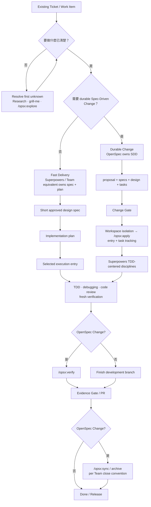

# Flow Responsibility Update Proposal

> Status: Approved and implemented
> Scope: Clarify the roles of OpenSpec and Superpowers without adding a new lifecycle
> Proposed target versions: `02` v1.11、`03` v1.8、`04` v1.9、`05` v1.9、`01` v1.23
> Review record: Approved by the project owner；the formal artifacts were updated without changing the Golden Flow or Three Human Gates.

---

## 1. Decision Summary

Keep the existing Golden Flow and Three Human Gates unchanged. Add one responsibility decision to tool routing:

> **OpenSpec owns Spec-Driven Development and change traceability. Superpowers enforces TDD-centered engineering disciplines.**

When both are used on the same change:

- OpenSpec is the change/spec SSOT and owns `proposal / specs / design / tasks / change status`.
- `/opsx:apply` remains the implementation entry and task ledger.
- Selected Superpowers skills govern how implementation is performed: workspace isolation、TDD、systematic debugging、code review and fresh completion verification.
- Superpowers must not create a second design spec、implementation plan or task ledger unless an approved integration redirects those outputs into the OpenSpec Change.
- CI、PR and the accountable Human Gate Owner remain the source of completion evidence and approval.

For a clear bounded P0/P1 that does not need durable change context, use Superpowers end-to-end without OpenSpec. In that route, the Superpowers design spec and plan are the SSOT.

This is a responsibility split, not a mandatory OpenSpec → Superpowers chain.

---

## 2. Why This Correction Is Needed

The current wording is directionally useful but incomplete:

> OpenSpec preserves context continuity; Superpowers provides engineering execution discipline.

The latest upstream behavior shows that both frameworks cover most lifecycle stages:

- OpenSpec creates proposal/spec/design/tasks, implements through `/opsx:apply`, checks artifact/implementation alignment through `/opsx:verify`, and updates durable truth through `/opsx:sync` and `/opsx:archive`.
- Superpowers creates a design spec through `brainstorming`, creates an implementation plan through `writing-plans`, executes through `executing-plans` or `subagent-driven-development`, and includes TDD、debugging、code review、verification and branch completion.

Therefore, the difference is not “one plans and one implements.” The useful distinction is their primary responsibility:

| Framework | Primary responsibility | Also overlaps with |
|---|---|---|
| **OpenSpec** | Spec-Driven Development、durable change agreement、artifact coherence and change history | Implementation and verification |
| **Superpowers** | TDD-centered engineering disciplines and systematic execution method | Design spec、planning and lifecycle orchestration |

Without an explicit ownership rule, mixed use can create:

1. OpenSpec `design.md` plus `docs/superpowers/specs/...-design.md`.
2. OpenSpec `tasks.md` plus `docs/superpowers/plans/...md`.
3. `/opsx:apply` plus a separate Superpowers execution ledger.
4. `/opsx:verify` being mistaken for TDD、code review or Human approval.
5. Engineers having to remember framework names instead of choosing the next engineering responsibility.

Primary sources:

- [OpenSpec command lifecycle](https://github.com/Fission-AI/OpenSpec/blob/main/docs/commands.md)
- [Superpowers basic workflow](https://github.com/obra/superpowers)
- [Superpowers brainstorming spec output](https://github.com/obra/superpowers/blob/main/skills/brainstorming/SKILL.md)
- [Superpowers implementation-plan output](https://github.com/obra/superpowers/blob/main/skills/writing-plans/SKILL.md)
- [OpenSpec community `superpowers-bridge`](https://github.com/Fission-AI/OpenSpec/blob/main/docs/customization.md)

---

## 3. Proposed Operating Model

### 3.1 Responsibility Ownership Map

| Responsibility | Accountable owner | Approved implementation choices | Ownership rule |
|---|---|---|---|
| **Direction／roles** | Existing Product／Engineering／Team owner | Existing Team workflow and role model | Do not introduce gstack or another role framework |
| **Spec-Driven Development** | Feature／Change Owner | OpenSpec；for Fast Delivery, Superpowers spec/plan or an approved Team equivalent | One change has one spec/design/plan SSOT |
| **TDD engineering disciplines** | Engineer／Tech Lead | Superpowers or approved Team equivalent | May operate inside the selected lifecycle；does not become another artifact owner |
| **Execution orchestration** | Change Owner | `/opsx:apply`、Superpowers execution flow or approved Team runner | Select one execution entry and one task ledger |
| **Evidence／approval** | Existing Human Gate Owner | Tests、CI、PR、code review、OpenSpec verify、release evidence | AI prepares evidence；Human remains approver |

The Framework should teach the responsibility first and implementation second. It should not add gstack、Ralph or any other framework merely to fill a row in this map.

### 3.2 Proposed Flow



The new decision is not a new Golden Stage or Human Gate. It is part of selecting the implementation for the current Stage.

---

## 4. Three Practical Routes

### 4.1 Fast Delivery

Use when:

- The P0/P1 outcome and intended behavior are clear.
- Work is bounded and normally fits one Engineer/AI session or a short handoff.
- Ticket + PR evidence is sufficient durable context.
- There is no long-lived behavior contract、cross-repository change agreement or audit need.

Default route:

```text
Ticket
→ Superpowers brainstorming
→ approved design spec
→ Superpowers writing-plans
→ worktree / selected execution flow
→ test-driven-development
→ requesting/receiving-code-review
→ verification-before-completion
→ PR / Evidence Gate
```

Rules:

- Superpowers owns the design spec and implementation plan.
- OpenSpec is not added “for completeness.”
- Upstream Superpowers may scale the design content to a small change, but its full workflow still creates a spec and plan. An approved Team adapter may place equivalent information in an existing ticket/PR, but must not claim it ran unmodified upstream behavior.
- Human approval and evidence requirements remain risk-based.

### 4.2 Durable Change

Use when one or more apply:

- Another session、AI or Engineer must continue from the same why/what/how/tasks.
- The behavior contract must be maintained after implementation.
- Multiple engineers、repositories or teams need a shared change agreement.
- API、data、cross-system、compliance or L2–L3 change needs traceability.
- Design decisions and change history must be updated、synced or archived.

Default route:

```text
Ticket
→ /opsx:explore                         optional, only when exploration is needed
→ /opsx:propose or new/continue
→ proposal + specs + design + tasks
→ Change Gate
→ using-git-worktrees                   when isolation is needed
→ /opsx:apply                           execution entry and task ledger
     ├─ test-driven-development
     ├─ systematic-debugging            on unexpected failure
     ├─ requesting/receiving-code-review
     └─ verification-before-completion
→ /opsx:verify                          artifact/implementation alignment
→ PR / Evidence Gate
→ /opsx:sync / archive                  when the Team close convention is satisfied
```

Rules:

- OpenSpec owns proposal/spec/design/tasks and the change state.
- `/opsx:apply` can write code and run tests; Superpowers adds a stricter method, not the existence of implementation.
- `/opsx:verify` checks completeness、correctness and coherence; it does not replace test-first evidence、independent code review、runtime/NFR tests or Human approval.
- Do not invoke the complete upstream Superpowers artifact-writing flow inside this route unless an approved bridge redirects its outputs into the OpenSpec Change.
- If the environment cannot reliably prevent duplicate Superpowers artifacts, use OpenSpec-native apply plus manually mapped engineering disciplines, or keep the frameworks separate.

### 4.3 Discovery First

Use when the next decision cannot yet be stated safely.

```text
First unknown
├─ current system/domain unclear       → system/codebase research
├─ owner decisions remain tacit        → grill-me
└─ change/options/scope unclear        → /opsx:explore

Once clear
→ choose Fast Delivery or Durable Change
```

Rules:

- Do not run research、`grill-me`、`/opsx:explore` and `brainstorming` as mandatory consecutive steps.
- Resolve the first material unknown, then route again.
- Discovery does not automatically create a durable Change.

---

## 5. Golden Stage Contract After the Correction

Golden Flow remains:

```text
Research → Design → Plan → Implement → Validate → Release & Operate
```

| Golden Stage | Responsibility after correction | Fast Delivery implementation | Durable Change implementation | Gate/evidence boundary |
|---|---|---|---|---|
| **Research** | Establish current state、problem、scope and unknowns | Manual research、`grill-me` as needed | Manual research、`/opsx:explore` or `grill-me` as needed | Understanding Gate remains unchanged |
| **Design** | Select and approve behavior/technical approach | Superpowers `brainstorming` owns design spec | OpenSpec proposal/spec/design owns durable design | Change Gate owns Human approval |
| **Plan** | Produce bounded delivery slices and executable next steps | Superpowers `writing-plans` or approved equivalent | OpenSpec `tasks.md`；optional JIT detail must stay within the same SSOT | No duplicate plan or task ledger |
| **Implement** | Produce tested bounded change | Superpowers worktree/execution/TDD | `/opsx:apply` owns entry/tracking；Superpowers skills enforce TDD/debug discipline | Targeted verification during implementation |
| **Validate** | Independently review and produce fresh evidence | Superpowers code review + completion verification | Same engineering evidence plus `/opsx:verify` alignment | Evidence Gate remains Human-owned |
| **Close** | Update durable truth and finish branch/change | `finishing-a-development-branch` and Team PR convention | Evidence decision followed by sync/archive per Team convention | Archive is not Human approval |

Code review stage ownership remains **Validate**. `requesting-code-review` may be invoked after Implement tasks/checkpoints; feedback requiring a code change returns to Implement, then re-enters Validate with fresh evidence.

---

## 6. Mixed-Mode Integration Contract

A Team may claim “OpenSpec + Superpowers” only when the following fields are explicit:

| Contract field | Required decision |
|---|---|
| **Spec owner** | OpenSpec Change or Superpowers spec/plan；never both |
| **Design location** | One canonical path, with other artifacts linking rather than copying |
| **Plan/task location** | One task ledger；optional detail nests under or references it |
| **Execution entry** | `/opsx:apply`、Superpowers executor or approved runner；one primary entry |
| **TDD policy** | Named skill/equivalent、test seam and required failure/pass evidence |
| **Review policy** | When review is requested、how feedback is verified and how findings close |
| **Completion evidence** | Fresh commands/tests、runtime/NFR evidence where triggered |
| **Human decision record** | Existing ticket/design/PR/release System of Record |

### 6.1 Department Default Mixed Profile

Recommended initial Department profile:

```text
Spec owner          OpenSpec
Design/task SSOT    openspec/changes/<name>/
Execution entry     /opsx:apply
Engineering method  Superpowers TDD/debug/review/verification skills
Alignment check     /opsx:verify
Approval            Existing PR + Human Gate
Close               /opsx:sync/archive after accepted evidence
```

This profile intentionally does not require Superpowers `brainstorming`、`writing-plans`、`executing-plans` or `subagent-driven-development`. Those can be added only through an approved integration that proves output ownership and stop conditions.

### 6.2 Community Bridge Status

The community `superpowers-bridge` demonstrates that full integration is possible by redirecting Superpowers outputs into the OpenSpec Change. It is not an OpenSpec core schema and should remain a **candidate pilot**, not the Department default.

Adoption requires:

- Review and pin the schema version/commit.
- Verify the supported agent environment and subagent requirement.
- Test that narrative invocation cannot bypass output redirection.
- Verify no duplicate spec/plan/task ledger is created.
- Verify upgrade behavior against both upstream release cadences.

---

## 7. Routing Change Without Adding a Seventh Question

Keep the existing Six Golden Questions. Extend **Question 6 — Next Move** to include:

```text
Next Move = required capability
          + primary lifecycle/spec owner
          + execution entry
          + minimum evidence
          + next Human Gate
```

Engineer-facing compact router:

1. **What is the first material unknown?** Resolve it with one capability.
2. **Is the intended change clear?** If not, remain in Research/Design.
3. **Does this need a durable Spec-Driven Change?**
   - No → Fast Delivery; Superpowers/Team equivalent owns spec and plan.
   - Yes → Durable Change; OpenSpec owns SDD.
4. **What engineering disciplines are required?** TDD、debugging、review、verification according to risk.
5. **What existing Human Gate record authorizes the next move?**

This is a selection aid inside the Golden Flow, not another workflow.

---

## 8. Team Profiles

| Team profile | Default lifecycle/spec owner | Execution discipline | Suitable default use |
|---|---|---|---|
| **Fast Delivery** | Superpowers spec/plan or approved Team equivalent | Superpowers TDD-centered disciplines | Clear bounded P0/P1、low handoff cost |
| **Durable Change** | OpenSpec | `/opsx:apply` plus mapped TDD/debug/review/verification | Cross-session/team、contract or traceability need |
| **Discovery First** | None until direction is clear | Research、`grill-me` or `/opsx:explore` | High ambiguity、legacy/migration、unknown scope |

Team habit and tool familiarity may determine the default profile after objective need is satisfied. They cannot lower architecture triggers、risk controls、required tests/review、Human Gates or evidence quality.

---

## 9. Stage × Framework Map

This matrix is a capability map, not a mandatory chain.

| Framework / family | Research | Design | Plan | Implement | Validate / Close |
|---|---|---|---|---|---|
| **Department / Team** | `system-research`、`codebase-research` | System Design when triggered | P1 → P0 decomposition policy | Engineering quality bar | CI、PR、Human Gate、release evidence |
| **OpenSpec** | `/opsx:explore` | `/opsx:propose` or `new/continue` | `tasks.md` | `/opsx:apply` | `/opsx:verify → sync → archive` |
| **Superpowers** | `systematic-debugging` for evidence-led bug work | `brainstorming` | `writing-plans` | worktrees、TDD、executing/subagents、debugging | request/receive code review、completion verification、branch finish |
| **Matt Pocock skills** | `grill-me` | `grill-with-docs` and optional architecture aid | `to-tickets` pilot for P1 → P0 | Not a Department default in this correction | Optional artifact challenge |

Matt `to-spec` and `wayfinder` remain optional upstream capabilities, not current Department defaults. gstack and Ralph are out of scope.

---

## 10. Document-by-Document Update Plan

### `02_Framework.md` → proposed v1.11

Add the canonical responsibility model to the core method/governance SSOT:

- Introduce Responsibility Ownership Map near capability routing/artifact placement.
- Replace the simplified OpenSpec/Superpowers statement with the canonical wording.
- State that both frameworks span Design through Validate; primary responsibility and ownership resolve overlap.
- Add the one-spec-owner、one-execution-entry、one-task-ledger rule.
- Clarify `/opsx:apply` implementation and `/opsx:verify` alignment boundaries.
- Preserve Golden Flow、Work Levels、Control Profile and Three Human Gates.
- Add v1.11 changelog entry: “SDD/TDD responsibility correction.”

### `03_Golden_Engineering_Playbook.md` → proposed v1.8

Make the proposal operational for Engineers:

- Update the quick selector to route Fast Delivery vs Durable Change.
- Add the Responsibility Ownership Map before the stage/skill matrix.
- Update Design、Plan、Implement and Validate stage cards with explicit owner rules.
- Show `/opsx:apply` as execution entry and task ledger in Durable Change.
- Nest Superpowers TDD/debug/review/verification disciplines inside the implementation path.
- Retain early `requesting-code-review` invocation with Validate stage ownership.
- Update scenarios for one clear P0 and one durable P1.
- Add v1.8 changelog entry.

### `guides/04_Framework_Overview.md` → proposed v1.9

Keep the overview visually compact:

- Insert the five-row Responsibility Map.
- Add the two-branch Fast Delivery/Durable Change diagram.
- Retain the Stage × Framework matrix as the answer to “which skill at which stage.”
- Replace “OpenSpec saves context; Superpowers executes” with the canonical wording.
- Explicitly show that OpenSpec has `apply/verify` and Superpowers has `spec/plan`.
- Keep gstack and Ralph out of the document.

### `guides/05_Decision_Tree.md` → proposed v1.9

Update routing, not lifecycle:

- First unknown remains the first decision.
- Add “Need durable Spec-Driven Change?” after intended behavior is clear.
- Fast path routes to Superpowers/Team equivalent.
- Durable path routes to OpenSpec-owned SDD plus selected engineering disciplines.
- Add checks for spec owner、execution entry and duplicate artifact risk.
- Keep OpenSpec profile/command details in the detailed appendix.

### `reference/Golden_Skill_Registry.md`

Update implementation truth:

- Add OpenSpec responsibility mapping including `/opsx:apply` and `/opsx:verify`.
- State that Superpowers is a full workflow when used alone, not merely a TDD plugin.
- Define the Department mixed profile as selected Superpowers disciplines inside OpenSpec SDD.
- Keep `superpowers-bridge` as a reviewed/pinned candidate, not active default.
- Keep Matt `to-tickets` as a possible pilot; do not activate `to-spec` or `wayfinder` by this correction.

### `01_AI_Handoff.md` → proposed v1.23

- Sync target document versions and the canonical responsibility wording.
- Record the approved ownership rules and non-goals.
- Keep Section 15 adoption checklist concise; do not add another long instruction block.
- Do not displace the existing E1 adoption action unless project priority is explicitly changed.

### No immediate change

- `00_Project_Charter.md`: Golden model and mission remain valid.
- `README.md`: role-based reading paths remain valid.
- `reference/Enforcement_E1_PR_Decision_Record.md`: enforcement scope is unrelated.
- `training/06_Training_Presentation.pptx`: assess after the text artifacts pass review; update only if the current training slide would teach the obsolete distinction.

No new formal lifecycle document、template、meeting、dashboard or tracking system is introduced.

---

## 11. Proposed Implementation Sequence

1. Obtain independent review of this proposal.
2. Resolve the reviewer questions in §15 and record the decision.
3. Update `02` first as the method/governance SSOT.
4. Update `03` as the Engineer execution SSOT.
5. Derive `04` and `05` from the approved core wording.
6. Update the Skill Registry and Handoff versions.
7. Run cross-document terminology and link validation.
8. Walk the acceptance scenarios in §12.
9. Inspect the diff for duplicate lifecycle、artifact or gate language.
10. Commit only after the complete documentation set is internally consistent.

---

## 12. Acceptance Scenarios

The updated flow must route each scenario without ambiguity.

### Scenario A — Clear P0 bug fix

- Ticket states expected behavior and reproduction.
- No durable behavior-contract change is needed.
- Route to Fast Delivery.
- Superpowers/Team equivalent owns the short spec/plan and TDD/review evidence.
- No OpenSpec Change is created.

### Scenario B — Durable P1 API change

- Multiple sessions/engineers must share requirements and design decisions.
- Route to OpenSpec-owned Durable Change.
- Human approves proposal/spec/design/tasks at Change Gate.
- `/opsx:apply` is the execution entry.
- TDD and code review are applied as engineering disciplines.
- `/opsx:verify` checks artifact/implementation alignment.
- PR holds the Evidence Gate decision; sync/archive updates durable truth.

### Scenario C — Existing OpenSpec Change, unclear implementation failure

- Stay within `/opsx:apply` task tracking.
- Invoke systematic debugging; do not create another plan or change.
- Return to TDD implementation after root cause is proven.
- Re-run code review、fresh verification and `/opsx:verify` as affected.

### Scenario D — Full upstream Superpowers already active

- If no OpenSpec durability need, use full Superpowers end-to-end.
- If an OpenSpec Change is required, Team must use an approved routing adapter/bridge or selected skills that do not create duplicate artifacts.
- The flow must not silently claim both specs/plans are SSOT.

### Scenario E — Requirement changes during implementation

- OpenSpec route: use `/opsx:update` or approved artifact update flow before continuing apply.
- Re-run the Change Gate only when the changed scope/risk/design requires it.
- Fast route: update the Superpowers-owned spec/plan or existing Team SSOT.
- Do not patch code while leaving the owning specification stale.

### Scenario F — Code review requests a change

- Validate owns the review finding.
- Technical feedback is verified before acceptance.
- Required code change returns to Implement.
- Tests and completion evidence are refreshed before Validate closes.

---

## 13. Acceptance Criteria

The correction is complete only when:

- [ ] An Engineer can explain the primary difference in one sentence: OpenSpec owns SDD; Superpowers enforces TDD-centered disciplines.
- [ ] Documentation acknowledges that OpenSpec implements/verifies and Superpowers creates spec/plans.
- [ ] Every mixed route declares one spec owner、one execution entry and one task ledger.
- [ ] Fast P0/P1 can use Superpowers without OpenSpec.
- [ ] Durable P0/P1 can use OpenSpec without requiring the full Superpowers artifact workflow.
- [ ] `/opsx:verify` is not described as a replacement for TDD、code review、runtime/NFR evidence or Human approval.
- [ ] Code review remains Validate-owned while allowing Implement checkpoints.
- [ ] Golden Flow、Three Human Gates、Work Levels and Control Profile are unchanged.
- [ ] gstack、Ralph、Matt `to-spec` and `wayfinder` are not added as defaults.
- [ ] Team preference can choose a default profile but cannot lower risk/architecture/evidence requirements.
- [ ] No duplicate formal document、dashboard、meeting or lifecycle is introduced.
- [ ] `02`、`03`、`04`、`05`、Registry and Handoff use consistent terminology.

---

## 14. Risks and Mitigations

| Risk | Impact | Mitigation |
|---|---|---|
| “Superpowers = TDD only” understates its full upstream workflow | Engineers misunderstand standalone use | Always say **TDD-centered engineering disciplines** and document its standalone spec/plan lifecycle |
| Full Superpowers auto-routing creates artifacts inside an OpenSpec Change flow | Dual SSOT | Require selected-skill profile or approved bridge；fail closed when output ownership is unclear |
| `tasks.md` is too coarse for complex implementation | Agent fills gaps or skips detail | Allow JIT detail within the same OpenSpec Change/P0 SSOT；pilot a reviewed integration before adding another plan |
| `/opsx:apply` and another executor both track progress | Conflicting task state | Require one execution entry and one ledger |
| `/opsx:verify` is treated as a quality gate by itself | Missing test/review/runtime evidence | Preserve separate TDD、code review、fresh verification and Human Evidence Gate contracts |
| Responsibility table becomes another abstract model | Adoption friction | Put it immediately before the concrete two-route flow and 60-second selector |
| Overview becomes too dense | Engineer ignores it | Keep five responsibility rows and two route branches；move detailed integration rules to `03`/Registry |
| Community bridge drifts from upstream | Breakage or silent discipline loss | Candidate status、pin/review/test、one-Team pilot only |

---

## 15. Questions for Independent Reviewer

1. Is the primary statement accurate and understandable without implying that OpenSpec cannot implement or Superpowers cannot create specs?
2. Does the proposed Durable Change route preserve OpenSpec as the SDD owner while using Superpowers only for explicitly selected engineering disciplines?
3. Is `/opsx:apply` the correct Department default execution entry for a mixed route, or should an approved subagent executor own execution instead?
4. Is OpenSpec `tasks.md` sufficient as the default task ledger, with JIT detail added only when needed?
5. Are the boundaries between `verification-before-completion`、code review、`/opsx:verify` and the Human Evidence Gate explicit enough?
6. Does the proposal respect upstream Superpowers behavior by distinguishing full standalone use from selected-skill mixed use?
7. Are Fast Delivery、Durable Change and Discovery First sufficient Team profiles without introducing another framework?
8. Are there any scenarios where this proposal would create two specs、two plans or two execution ledgers?
9. Should sync/archive occur before or after PR approval in the Department default, or remain a Team close convention after accepted evidence?
10. Can the document updates be completed without changing the Golden Flow、Three Human Gates、Work Levels or Control Profile?

Reviewer should return:

- **Decision**: Approve / Approve with corrections / Rework.
- **Blocking findings**: contradictions or unsafe routing.
- **Non-blocking improvements**: clarity or adoption suggestions.
- **Required source corrections**: claims that do not match current upstream behavior.
- **Recommended implementation scope**: which files must change now and which should wait.

---

## 16. Recommended Approval Decision

**Approve with a bounded implementation scope**:

- Update the textual core and Engineer supplements listed in §10.
- Do not add gstack、Ralph or a new formal lifecycle.
- Do not install or activate the community bridge as part of the documentation correction.
- Preserve the current E1 enforcement rollout as a separate adoption item.
- Reassess the training presentation only after the Markdown sources are approved and consistent.

The intended outcome is simpler routing:

> **Choose who owns the Spec-Driven Change, then apply the required TDD-centered engineering disciplines inside that lifecycle.**
